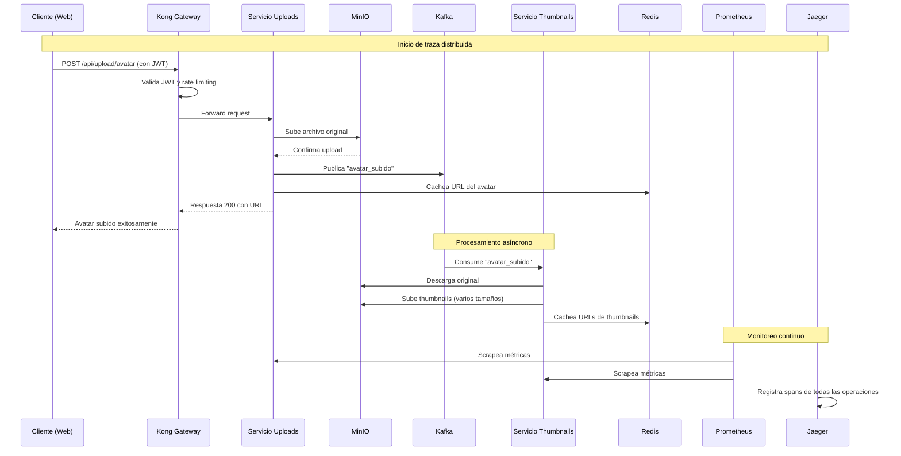
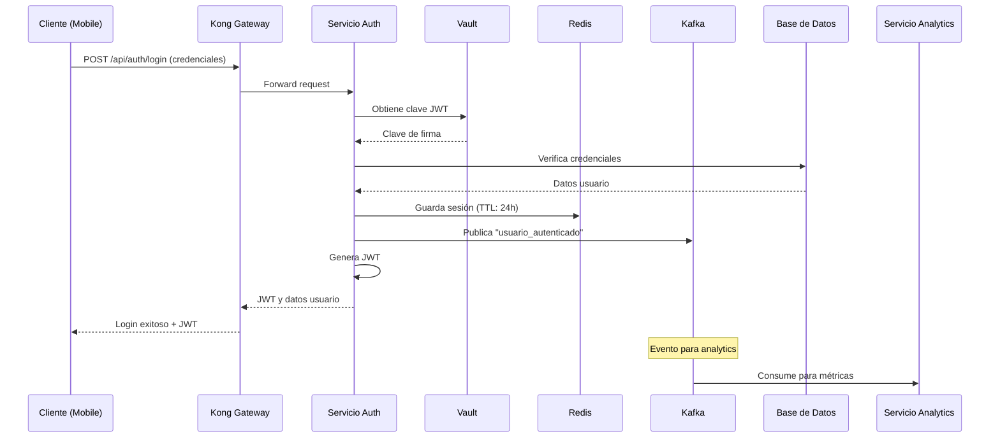
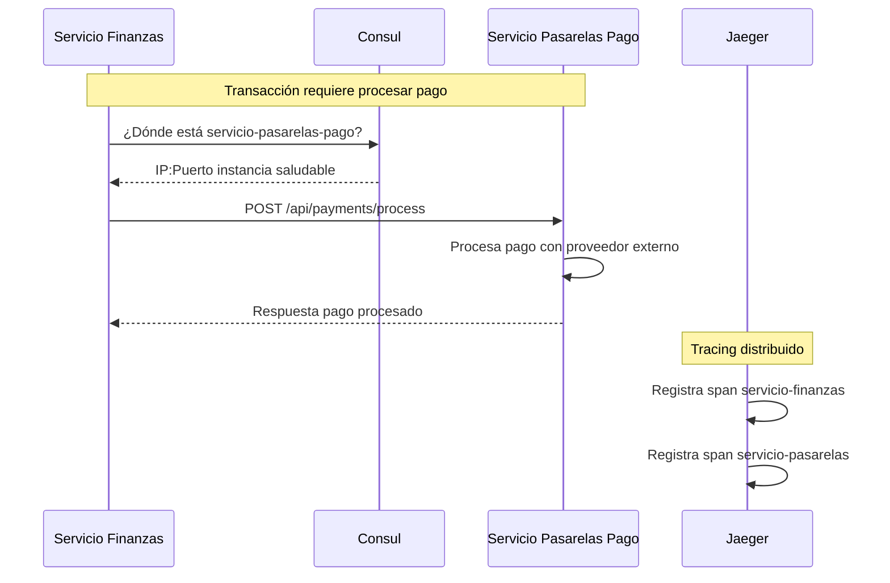
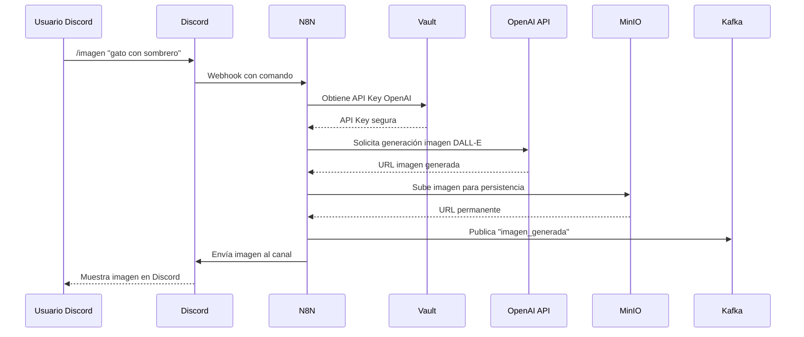
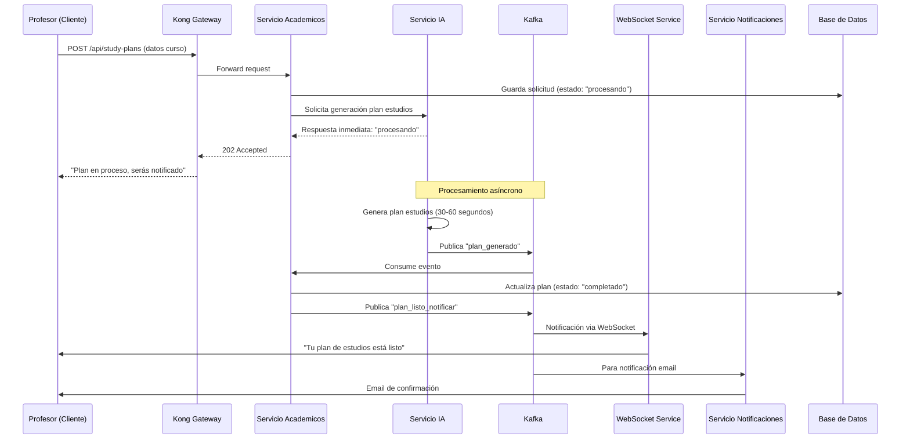
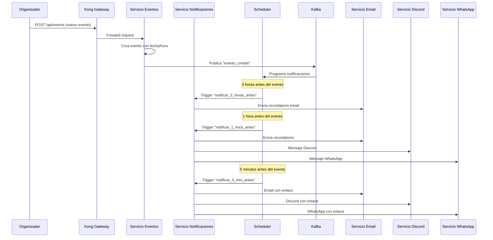
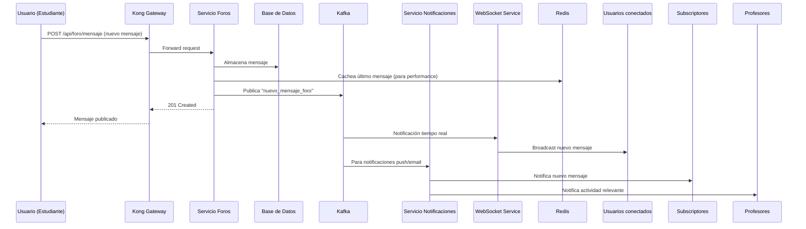
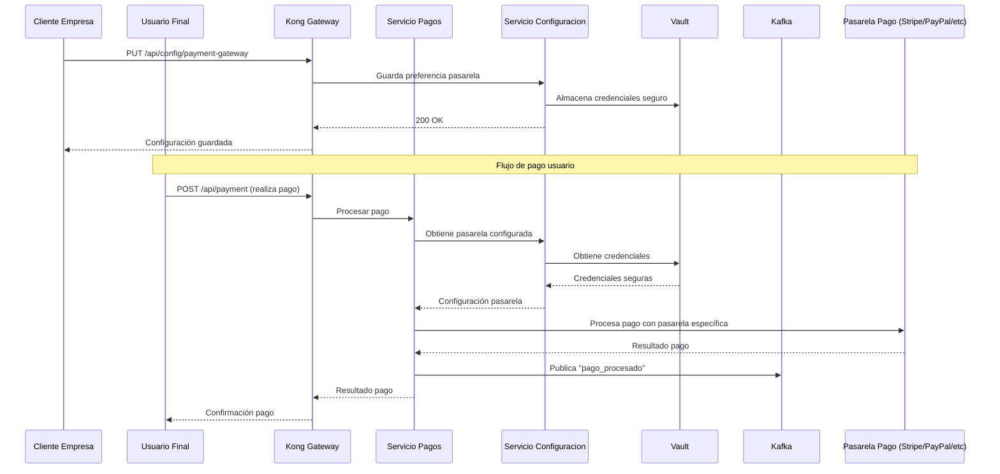

# Stack explicado para principiantes 🚀

¡Hola! 👋 Si acabas de empezar en desarrollo de software y te tocó trabajar con una pila de infraestructura, este README es para ti. Aquí te explico, de manera sencilla y con ejemplos, **qué hace cada servicio**, **cómo se conectan entre sí**, y **qué puedes esperar** cuando los uses en un proyecto real.

---

## 📚 Índice
- [Stack explicado para principiantes 🚀](#stack-explicado-para-principiantes-)
  - [📚 Índice](#-índice)
  - [1. ¿Para qué sirve esta guía? 📚](#1-para-qué-sirve-esta-guía-)
  - [2. Resumen rápido del stack ✅](#2-resumen-rápido-del-stack-)
  - [3. Descripción simple de cada servicio 🔍](#3-descripción-simple-de-cada-servicio-)
    - [🤖 Kafka](#-kafka)
    - [🚀 Redis](#-redis)
    - [🔍 Consul](#-consul)
    - [📇 Jaeger](#-jaeger)
    - [📊 Prometheus](#-prometheus)
    - [📈 Grafana](#-grafana)
    - [🚪 Kong (API Gateway)](#-kong-api-gateway)
    - [☁️ MinIO](#️-minio)
    - [🔐 Vault](#-vault)
    - [⚙️ N8N](#️-n8n)
  - [4. ¿Cómo se integran entre sí? - Flujos comunes 🔗](#4-cómo-se-integran-entre-sí---flujos-comunes-)
    - [🔄 Flujo A: Subida de archivo por usuario (ej. avatar)](#-flujo-a-subida-de-archivo-por-usuario-ej-avatar)
    - [🔐 Flujo B: Login y sesión](#-flujo-b-login-y-sesión)
    - [🔎 Flujo C: Microservicio descubriendo otro (Consul)](#-flujo-c-microservicio-descubriendo-otro-consul)
    - [🤖 Flujo D: Automatización con N8N para Mensajería](#-flujo-d-automatización-con-n8n-para-mensajería)
    - [🎓 Flujo E: Creación de plan de estudios con IA y notificación por WebSocket](#-flujo-e-creación-de-plan-de-estudios-con-ia-y-notificación-por-websocket)
    - [📅 Flujo F: Notificaciones de eventos programadas](#-flujo-f-notificaciones-de-eventos-programadas)
    - [💬 Flujo G: Foro de discusión entre estudiantes y profesores](#-flujo-g-foro-de-discusión-entre-estudiantes-y-profesores)
    - [💳 Flujo H: Pasarelas de pago específicas por cliente](#-flujo-h-pasarelas-de-pago-específicas-por-cliente)
  - [5. Buenas prácticas y recomendaciones de seguridad 🔒](#5-buenas-prácticas-y-recomendaciones-de-seguridad-)
  - [6. Glosario de términos para principiantes 🧠](#6-glosario-de-términos-para-principiantes-)

---

## 1. ¿Para qué sirve esta guía? 📚

Para que entiendas, paso a paso y con lenguaje simple, los servicios que suelen aparecer en proyectos modernos: mensajería, cache, observabilidad, gestión de secretos, almacenamiento de objetos y automatización. Todo explicado como si te lo contara un compañero con paciencia.

---

## 2. Resumen rápido del stack ✅

*   **Kafka** — mensajería / eventos
*   **Redis** — caché y estructuras rápidas en memoria
*   **Consul** — descubrimiento de servicios y checks de salud
*   **Jaeger** — trazado distribuido (tracing)
*   **Prometheus** — recolección de métricas
*   **Grafana** — dashboards para ver las métricas
*   **Kong** — API Gateway (punto de entrada a tus APIs)
*   **MinIO** — almacenamiento de archivos (compatible con S3)
*   **Vault** — gestión segura de secretos
*   **N8N** — automatización / orquestación low-code

---

## 3. Descripción simple de cada servicio 🔍

> Para cada servicio verás: **Qué es**, **Para qué sirve**, **Ejemplo sencillo**, y **¿Por qué usarlo en microservicios vs monolito?**

### 🤖 Kafka
*   **Qué es:** Un sistema para enviar y almacenar eventos/mensajes de manera rápida, duradera y en orden.
*   **Para qué sirve:** Comunicar partes de tu sistema sin que estén acopladas (producer → topic → consumer). Es ideal para procesar streams de datos.
*   **Ejemplo sencillo:** Cuando un usuario sube una foto, el servicio que recibe la foto publica un evento "foto_subida" en Kafka; otro servicio (thumbnailer) lee ese evento y crea miniaturas. 
*   **Microservicios:** Ideal. Permite desacoplar, procesar eventos en paralelo y volver a reproducir eventos si es necesario.
*   **Monolito:** Útil para pipelines (analítica), pero puede ser demasiado complejo si tu app es pequeña.

**💡 Ejemplo de Integración con WebSockets:**
Puedes usar Kafka como cola de mensajes para un chat en tiempo real. Cuando un usuario envía un mensaje, un WebSocket lo publica en un tema de Kafka. Otro servicio consume esos mensajes y los difunde a todos los clientes conectados via WebSocket. Esto te permite escalar los componentes de conexión y procesamiento de mensajes por separado.

### 🚀 Redis
*   **Qué es:** Base de datos en memoria, super rápida.
*   **Para qué sirve:** Caché, contadores, sesiones, pub/sub ligero, leaderboards para juegos.
*   **Ejemplo sencillo:** Cacheas la respuesta de una consulta a la DB durante 60 segundos para evitar repetir la consulta.
*   **Microservicios:** Muy útil para caches compartidas, locks distribuidos y rate limiting.
*   **Monolito:** Útil igualmente para caching y sesiones.

**💡 Ejemplo de Gamificación:**
Puedes usar las estructuras de datos de Redis (como **Sorted Sets**) para implementar un sistema de líderboards en una aplicación con elementos de gamificación. Cada vez que un usuario gana puntos, actualizas su puntuación en el sorted set. Redis mantiene el orden automáticamente, haciendo muy eficiente obtener el top 10 de usuarios.

### 🔍 Consul
*   **Qué es:** Registro y descubrimiento de servicios + health checks.
*   **Para qué sirve:** Permite a los servicios encontrarse entre sí sin IPs fijas en ambientes dinámicos.
*   **Ejemplo sencillo:** El servicio de usuarios registra su IP/puerto; el servicio de pedidos pide a Consul "¿dónde está el servicio de usuarios?" y Consul responde.
*   **Microservicios:** Muy útil para ambientes dinámicos donde las IPs cambian.
*   **Monolito:** Normalmente no necesario si todo se despliega junto.

### 📇 Jaeger
*   **Qué es:** Herramienta para seguir la ruta de una petición entre servicios (tracing distribuido).
*   **Para qué sirve:** Detectar qué servicio está lento o falla en una operación distribuida.
*   **Ejemplo sencillo:** Al procesar un pedido, Jaeger te muestra que la mayor latencia está en la llamada al servicio de pagos.
*   **Microservicios:** Casi imprescindible para depurar latencias.
*   **Monolito:** Útil para perfilar internamente pero de menor prioridad.

### 📊 Prometheus
*   **Qué es:** Sistema para recolectar métricas (números) de tus servicios.
*   **Para qué sirve:** Medir uso de CPU, memoria, peticiones por segundo, errores, etc.
*   **Ejemplo sencillo:** Monitorizas la cantidad de requests por minuto y alertas si sube mucho.
*   **Microservicios:** Cada servicio expone métricas; Prometheus las scrapea y centraliza.
*   **Monolito:** Igualmente útil para ver comportamiento y alertas.

### 📈 Grafana
*   **Qué es:** Herramienta para crear dashboards bonitos con tus métricas. 
*   **Para qué sirve:** Visualizar tendencias, montar paneles para SRE o producto.
*   **Ejemplo sencillo:** Dashboard con latencia promedio, errores 5xx, y número de usuarios activos.
*   **Microservicios y monolito:** Útil en ambos casos.

### 🚪 Kong (API Gateway)
*   **Qué es:** Punto único de entrada para tus APIs. Maneja autenticación, rate-limiting, logging.
*   **Para qué sirve:** Centralizar política de seguridad y enrutamiento.
*   **Ejemplo sencillo:** Todas las llamadas externas llegan primero a Kong; Kong valida el JWT y forwardea al servicio correspondiente.
*   **Microservicios:** Muy útil para aplicar reglas transversales sin tocar cada microservicio.
*   **Monolito:** Útil para exponer versiones públicas y gestionar SSL, aunque a veces un reverse proxy simple basta.

**💡 Ejemplo para Notificaciones Push:**
Kong puede actuar como un único punto de entrada para una API que gestiona notificaciones push. Puedes configurar un plugin de rate-limiting en Kong para evitar que un solo cliente envíe demasiadas notificaciones. También puede manejar la autenticación para los servicios de envío de SMS (Twilio) o Email (SendGrid, Mailgun).

### ☁️ MinIO
*   **Qué es:** Almacenamiento de objetos (archivos) compatible con S3.
*   **Para qué sirve:** Guardar fotos, documentos, backups, videos.
*   **Ejemplo sencillo:** El servicio de uploads guarda en MinIO; otro servicio lee desde MinIO para mostrar imágenes. 
*   **Microservicios:** Muy útil para centralizar archivos compartidos.
*   **Monolito:** Útil para manejar uploads internos sin depender de la nube.

### 🔐 Vault
*   **Qué es:** Almacén seguro para secretos (claves, contraseñas, certificados). 
*   **Para qué sirve:** Evitar poner contraseñas en código o repositorios. Puede generar credenciales bajo demanda y rotarlas automáticamente.
*   **Ejemplo sencillo:** Tus servicios piden credenciales a Vault en tiempo de ejecución y Vault entrega credenciales rotadas.
*   **Microservicios:** Crítico para seguridad; gestionar accesos por servicio.
*   **Monolito:** Recomendado para no hardcodear secretos.

**💡 Integración con Asistentes de IA:**
Puedes usar Vault para gestionar de forma segura las API Keys de servicios como OpenAI, DeepSeek o Gemini. Tu aplicación o bot (ej. un bot de Discord) solicita la clave a Vault cuando necesita hacer una petición, en lugar de tenerla hardcodeada en el código o en variables de entorno en texto plano. Vault puede incluso rotar estas claves si la API lo permite.

### ⚙️ N8N
*   **Qué es:** Herramienta para automatizar tareas (arrastrar y conectar nodos).
*   **Para qué sirve:** Orquestar integraciones sin escribir microservicios para todo.
*   **Ejemplo sencillo:** Cuando se crea un nuevo usuario, N8N envía un correo, añade el usuario a un CRM y sube un registro a Google Sheets.
*   **Microservicios:** Bueno como orquestador para integraciones con servicios externos.
*   **Monolito:** Útil para tareas operativas que no quieres codificar en la app principal.

**💡 Casos de Uso Avanzados:**
*   **Mensajería (WhatsApp/Telegram):** Configura un webhook en N8N que se active cuando recibe un mensaje de Twilio (para WhatsApp) o de la API de Telegram. Luego, según el contenido del mensaje, N8N puede consultar una base de datos, llamar a una API de IA para generar una respuesta inteligente, y enviar la respuesta de vuelta al usuario.
*   **Bots de Discord:** Un comando en Discord puede llegar a N8N via webhook. N8N puede procesarlo, por ejemplo, pidiendo a la API de OpenAI que genere una imagen (DALL-E) o un texto, y luego enviar el resultado de vuelta al canal de Discord.

---

## 4. ¿Cómo se integran entre sí? - Flujos comunes 🔗

A continuación verás varios *flujos* con pasos sencillos que muestran cómo los servicios pueden trabajar juntos. Piensa en estos como recetas.

### 🔄 Flujo A: Subida de archivo por usuario (ej. avatar)

**Descripción:** Un usuario sube su foto de perfil a través de la aplicación web.

1. El usuario selecciona y sube una imagen de avatar desde la interfaz web
2. El sistema valida su identidad, almacena la imagen original y genera miniaturas automáticamente
3. Las URLs de las imágenes se guardan en caché para acceso rápido
4. El usuario recibe confirmación inmediata mientras el procesamiento continúa en segundo plano

### 🔐 Flujo B: Login y sesión

**Descripción:** Un usuario inicia sesión en la plataforma educativa.

1. El usuario ingresa sus credenciales en la aplicación móvil
2. El sistema verifica las credenciales y genera un token JWT seguro
3. La sesión se almacena en Redis con tiempo de expiración
4. Se notifica a otros servicios sobre el inicio de sesión para analytics
5. El usuario recibe el token para acceder a recursos protegidos

### 🔎 Flujo C: Microservicio descubriendo otro (Consul)

**Descripción:** El servicio de finanzas necesita consultar el servicio de pasarelas de pago para procesar una transacción.

1. El servicio de finanzas consulta a Consul para encontrar una instancia saludable del servicio de pasarelas de pago
2. Consul devuelve la ubicación de una instancia disponible
3. El servicio de finanzas se comunica directamente con la pasarela de pago para procesar la transacción
4. Todo el proceso es rastreado para monitorización distribuida

### 🤖 Flujo D: Automatización con N8N para Mensajería

**Descripción:** Un usuario solicita generar una imagen mediante comando de Discord.

1. Un usuario ejecuta un comando de Discord para generar una imagen con IA
2. Discord envía el comando a N8N mediante webhook
3. N8N recupera de forma segura la API Key de OpenAI desde Vault
4. Se genera la imagen usando DALL-E y se almacena permanentemente en MinIO
5. La imagen generada se envía de vuelta al canal de Discord y se notifica a otros servicios

### 🎓 Flujo E: Creación de plan de estudios con IA y notificación por WebSocket

**Descripción:** Un profesor solicita la creación de un plan de estudios personalizado usando IA, con notificación en tiempo real cuando esté listo.

1. Un profesor solicita crear un plan de estudios personalizado para un curso
2. El sistema acepta la solicitud y la envía a procesamiento asíncrono
3. El servicio de IA tarda 30-60 segundos en generar el plan educativo
4. Una vez completado, se notifica al profesor en tiempo real mediante WebSocket
5. También se envía una confirmación por email para registro

### 📅 Flujo F: Notificaciones de eventos programadas

**Descripción:** El sistema notifica automáticamente a participantes de eventos 3 horas antes, 1 hora antes y 5 minutos antes del evento.

1. Un organizador crea un nuevo evento en el sistema
2. El sistema programa automáticamente recordatorios en momentos específicos
3. Se envían notificaciones escalonadas: 3 horas antes por email, 1 hora antes por múltiples canales, y 5 minutos antes con enlaces directos
4. Los participantes reciben recordatorios oportunos por sus canales preferidos

### 💬 Flujo G: Foro de discusión entre estudiantes y profesores

**Descripción:** Sistema de foros donde estudiantes y profesores discuten temas y tareas con notificaciones en tiempo real.

1. Un estudiante publica un mensaje en el foro del curso
2. El mensaje se almacena en la base de datos y se cachea para mejor rendimiento
3. Los demás usuarios reciben notificaciones en tiempo real mediante WebSocket
4. Los profesores y suscriptores reciben notificaciones push o por email sobre la nueva actividad
5. La discusión se mantiene fluida con actualizaciones instantáneas para todos los participantes

### 💳 Flujo H: Pasarelas de pago específicas por cliente

**Descripción:** Diferentes empresas clientes pueden configurar sus propias pasarelas de pago preferidas (Stripe, PayPal, MercadoPago).

1. Una empresa cliente configura su pasarela de pago preferida en el sistema
2. Las credenciales de la pasarela se almacenan de forma segura en Vault
3. Cuando un usuario final realiza un pago, el sistema consulta la configuración específica de esa empresa
4. Se recuperan las credenciales seguras y se procesa el pago con la pasarela configurada
5. El resultado del pago se notifica y se registra para seguimiento

---

## 5. Buenas prácticas y recomendaciones de seguridad 🔒

*   **Nunca** guardes secretos en código o repositorios. Usa Vault. 
*   Protección de UIs: Redis Commander, Konga, Kafka UI no deben estar públicas sin autenticación.
*   TLS siempre para tráfico externo (Kong puede manejar TLS termination).
*   Controla la cardinalidad en Prometheus (evita demasiadas etiquetas dinámicas).
*   Sampling en Jaeger: no traces al 100% si no tienes capacidad de almacenamiento.
*   Respaldos para MinIO y configuraciones de Kafka (no pierdas datos). 

---

## 6. Glosario de términos para principiantes 🧠

*   **Broker:** Servidor que recibe y entrega mensajes (Kafka es un broker). 
*   **Topic:** Canal/tema donde se publican mensajes en un sistema de mensajería como Kafka.
*   **Cache:** Almacenamiento temporal para respuestas rápidas (Redis).
*   **Tracing / Trace / Span:** Seguimiento de una petición paso a paso (Jaeger). Un "trace" es el camino completo, y un "span" representa una única operación dentro de ese camino.
*   **Metric / Scrape:** Número medido (requests/sec); Prometheus "scrapea" endpoints para recogerlas.
*   **API Gateway:** Puerta de entrada para las APIs; gestiona auth, límites y logging (Kong).
*   **Object Storage / Bucket:** Lugar para guardar archivos como objetos, en lugar de en una jerarquía de archivos (MinIO, S3). 
*   **Secrets:** Credenciales / claves que debes proteger (Vault). 
*   **Webhook:** Una URL que acepta peticiones HTTP (normalmente POST) de un servicio externo para notificar sobre un evento.
*   **Pub/Sub (Publicar/Suscribir):** Patrón de mensajería donde los "emisores" (publishers) envían mensajes a un "topic" sin saber qué "receptores" (subscribers) los recibirán.
*   **WebSocket:** Protocolo de comunicación que permite una conexión bidireccional y persistente entre cliente y servidor.
*   **Rate Limiting:** Limitar la cantidad de peticiones que un cliente puede hacer en un período de tiempo.
*   **Health Check:** Verificación periódica para determinar si un servicio está funcionando correctamente.