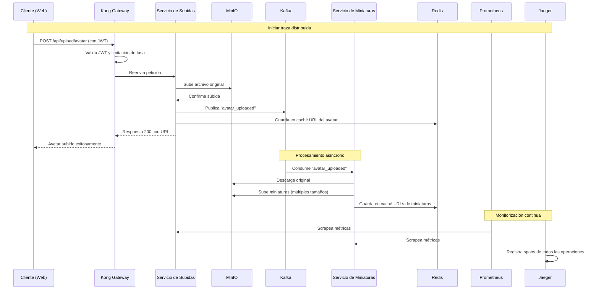
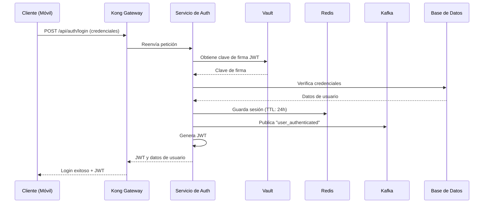
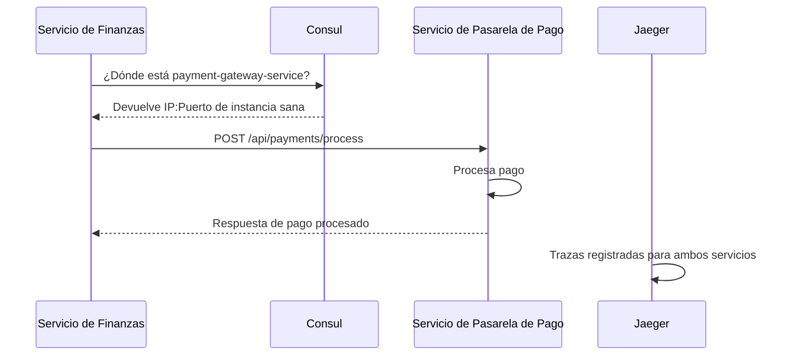
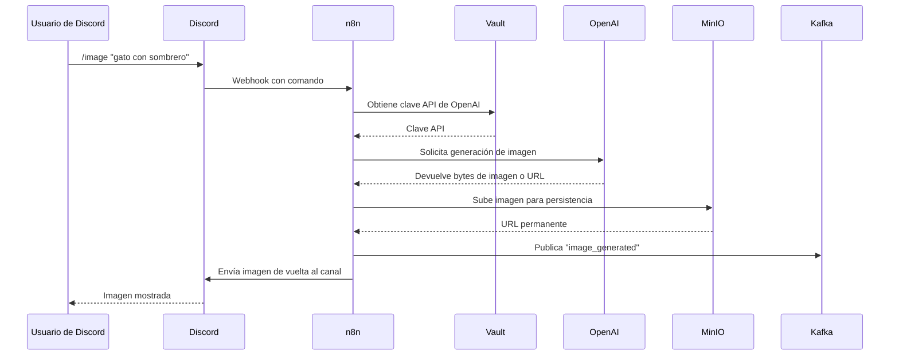

# Dev Container — Entorno de Desarrollo Multi-Servicio

> Un `README.md` completo que explica cada servicio, incluye diagramas de secuencia de casos de uso del mundo real y da **ejemplos de conexión** para **Node.js, PHP, Go, .NET, Rust y Java**.
> Destinado a desarrolladores que usan este contenedor de desarrollo Docker Compose para monolitos o microservicios.

---

[](https://www.docker.com/) [](https://choosealicense.com/licenses/mit/) [](https://microservices.io/) [](https://github.com/hashicorp/hcl)

**Autores:** [@Santiago1010](https://github.com/Santiago1010)

---

# Tabla de contenidos

- [Dev Container — Entorno de Desarrollo Multi-Servicio](#dev-container--entorno-de-desarrollo-multi-servicio)
- [Tabla de contenidos](#tabla-de-contenidos)
- [Descripción General](#descripción-general)
- [Características](#características)
- [Variables de entorno](#variables-de-entorno)
- [Ejecutar localmente](#ejecutar-localmente)
- [Servicios — explicación y propósito](#servicios--explicación-y-propósito)
  - [Kafka](#kafka)
  - [Redis](#redis)
  - [Consul](#consul)
  - [Jaeger](#jaeger)
  - [Prometheus](#prometheus)
  - [Grafana](#grafana)
  - [Kong (API Gateway)](#kong-api-gateway)
  - [MinIO](#minio)
  - [Vault](#vault)
  - [n8n](#n8n)
- [Flujos comunes — Casos de uso con diagramas de secuencia](#flujos-comunes--casos-de-uso-con-diagramas-de-secuencia)
  - [Flujo A — Subida de archivos de usuario (avatar + miniaturas asíncronas)](#flujo-a--subida-de-archivos-de-usuario-avatar--miniaturas-asíncronas)
  - [Flujo B — Login y sesión (Vault + Redis + Kafka)](#flujo-b--login-y-sesión-vault--redis--kafka)
  - [Flujo C — Descubrimiento de servicios con Consul](#flujo-c--descubrimiento-de-servicios-con-consul)
  - [Flujo D — Automatización vía n8n (Discord + IA + MinIO)](#flujo-d--automatización-vía-n8n-discord--ia--minio)
  - [Flujos adicionales (resumidos)](#flujos-adicionales-resumidos)
- [Ejemplos de conexión — por servicio y lenguaje](#ejemplos-de-conexión--por-servicio-y-lenguaje)
  - [Redis](#redis-1)
  - [PostgreSQL](#postgresql)
  - [Kafka](#kafka-1)
  - [Consul](#consul-1)
  - [Vault](#vault-1)
  - [MinIO (API S3)](#minio-api-s3)
  - [Kong (API Gateway)](#kong-api-gateway-1)
  - [Observabilidad — Jaeger y Prometheus](#observabilidad--jaeger-y-prometheus)
- [Referencia de API — UIs y puertos de servicio](#referencia-de-api--uis-y-puertos-de-servicio)
- [Mejores prácticas de seguridad y recomendaciones](#mejores-prácticas-de-seguridad-y-recomendaciones)
- [Preguntas Frecuentes (FAQ)](#preguntas-frecuentes-faq)
- [Contribuir](#contribuir)
- [Licencia y Agradecimientos](#licencia-y-agradecimientos)
- [Glosario (para principiantes)](#glosario-para-principiantes)

---

# Descripción General

Este repositorio contiene un entorno de desarrollo Docker Compose con infraestructura comúnmente usada para aplicaciones modernas:

* **Kafka (+ Zookeeper)** — streaming de eventos
* **Redis** — caché en memoria y pub/sub
* **PostgreSQL (múltiples instancias)** — bases de datos relacionales
* **Consul** — descubrimiento de servicios y comprobaciones de salud
* **Vault** — gestor de secretos
* **n8n** — herramienta de automatización de flujos de trabajo low-code
* **Jaeger** — traza distribuida
* **Prometheus + Grafana** — monitorización y dashboards
* **MinIO** — almacenamiento de objetos compatible con S3
* **Kong** — puerta de enlace de API y aplicación de políticas

Úsalo para prototipar integraciones, probar observabilidad, ejercitar flujos de eventos o ejecutar tests de integración locales.

---

# Características

* Servicios locales preconfigurados para desarrollo
* Archivo .env de ejemplo y script de prueba para verificar la salud de los servicios
* Ejemplos de conexión a servicios desde múltiples lenguajes
* Flujos de arquitectura comunes documentados y visualizados con diagramas de secuencia
* Demostración básica de monitorización, traza y secretos

---

# Variables de entorno

Copia `.env.example` → `.env` y ajusta:

```bash
# Redis
REDIS_PASSWORD=redispass123

# PostgreSQL (n8n)
POSTGRES_USER=n8n
POSTGRES_PASSWORD=n8npassword
POSTGRES_DB=n8n

# PostgreSQL (Kong)
KONG_PG_USER=kong
KONG_PG_PASSWORD=kongpassword
KONG_PG_DATABASE=kong

# n8n
N8N_ENCRYPTION_KEY=n8n-encryption-key-change-this

# Grafana
GRAFANA_ADMIN_USER=admin
GRAFANA_ADMIN_PASSWORD=admin123

# MinIO
MINIO_ROOT_USER=minioadmin
MINIO_ROOT_PASSWORD=minioadmin123
```

---

# Ejecutar localmente

```bash
git clone https://github.com/Santiago1010/dev-container
cd dev-container
docker-compose up -d
./scripts/test_services.sh   # verifica la salud de los servicios
```

Para resetear completamente los volúmenes de datos:

```bash
docker-compose down -v
docker-compose up -d
```

---

# Servicios — explicación y propósito

A continuación se explica brevemente cada servicio con un ejemplo corto de por qué y cuándo usarlo.

## Kafka

* **Qué:** Plataforma de streaming distribuida (publicar/suscribir, logs duraderos).
* **Uso:** Desacoplar productores/consumidores, construir sistemas dirigidos por eventos, pipelines de análisis, historial de eventos reproducible.
* **Por qué:** Escalar consumidores independientemente, garantizar orden por partición, retener historial de eventos.

## Redis

* **Qué:** Almacén clave-valor en memoria.
* **Uso:** Caché, sesiones, limitación de tasa, bloqueos, tablas de clasificación, pub/sub ligero.
* **Por qué:** Latencia extremadamente baja para datos calientes y estado efímero.

## Consul

* **Qué:** Registro de servicios + comprobaciones de salud + almacén KV simple.
* **Uso:** Descubrimiento dinámico de servicios, estado de salud, distribución de configuración.
* **Por qué:** Útil cuando las instancias van y vienen (ej., contenedores, autoescalado).

## Jaeger

* **Qué:** Sistema de traza distribuida.
* **Uso:** Trazar peticiones a través de microservicios, encontrar cuellos de botella de latencia y errores.
* **Por qué:** Observabilidad en sistemas distribuidos.

## Prometheus

* **Qué:** Recogida de métricas mediante scraping de endpoints.
* **Uso:** Métricas de recursos/aplicación, reglas de alerta.
* **Por qué:** El modelo de extracción se adapta a servicios efímeros y expone métricas sobre HTTP.

## Grafana

* **Qué:** Visualización y dashboards para métricas/trazas.
* **Uso:** Construir dashboards (latencia, errores, rendimiento), visualización de alertas.
* **Por qué:** Panel único para métricas de SRE y producto.

## Kong (API Gateway)

* **Qué:** Puerta de enlace de API con sistema de plugins.
* **Uso:** Autenticación central, limitación de tasa, enrutamiento, plugins de observabilidad.
* **Por qué:** Centralizar preocupaciones transversales fuera del código de aplicación.

## MinIO

* **Qué:** Almacenamiento de objetos compatible con S3.
* **Uso:** Almacenar subidas, backups, archivos multimedia localmente en desarrollo.
* **Por qué:** Funciona como S3 pero local y fácil de probar.

## Vault

* **Qué:** Gestión de secretos, secretos dinámicos, encriptación.
* **Uso:** Guardar claves API, credenciales de BD, rotar credenciales de forma segura.
* **Por qué:** Evitar secretos en el código y proporcionar control de acceso granular.

## n8n

* **Qué:** Herramienta de automatización/orquestación low-code.
* **Uso:** Conectar APIs externas, construir webhooks, integraciones simples sin código.
* **Por qué:** Rápido para construir integraciones y automatización para flujos no core.

---

# Flujos comunes — Casos de uso con diagramas de secuencia

Los flujos a continuación usan diagramas de secuencia `mermaid`. Describen la interacción típica entre servicios.

---

## Flujo A — Subida de archivos de usuario (avatar + miniaturas asíncronas)



---

## Flujo B — Login y sesión (Vault + Redis + Kafka)



---

## Flujo C — Descubrimiento de servicios con Consul



---

## Flujo D — Automatización vía n8n (Discord + IA + MinIO)



---

## Flujos adicionales (resumidos)

* Recordatorios de eventos programados (programador → Kafka → notificaciones)
* Mensajería en tiempo real en foro (publicación → BD → Kafka → difusiones WebSocket → caché Redis)
* Pasarelas de pago específicas de cliente almacenadas en Vault, devueltas en tiempo de ejecución para procesamiento

---

# Ejemplos de conexión — por servicio y lenguaje

> Estos ejemplos son fragmentos mínimos de conexión/lectura/escritura para empezar. Reemplaza host/puerto/credenciales con tus valores de `.env`. Añade preocupaciones de producción (TLS, reintentos, timeouts, manejo de errores) para despliegues reales.

---

## Redis

**Node.js (redis v4)**

```javascript
import { createClient } from 'redis';
const client = createClient({ url: 'redis://:redispass123@localhost:6379' });
await client.connect();
await client.set('key', 'value');
const v = await client.get('key');
console.log(v);
await client.disconnect();
```

**PHP (Predis)**

```php
require 'vendor/autoload.php';
$client = new Predis\Client([
  'scheme' => 'tcp', 'host' => '127.0.0.1', 'port' => 6379, 'password' => 'redispass123'
]);
$client->set('key', 'value');
echo $client->get('key');
```

**Go (go-redis v9)**

```go
ctx := context.Background()
rdb := redis.NewClient(&redis.Options{Addr: "localhost:6379", Password: "redispass123", DB: 0})
defer rdb.Close()
err := rdb.Set(ctx, "key", "value", 0).Err()
val, err := rdb.Get(ctx, "key").Result()
fmt.Println(val)
```

**.NET (StackExchange.Redis)**

```csharp
var conn = await ConnectionMultiplexer.ConnectAsync("localhost:6379,password=redispass123");
var db = conn.GetDatabase();
await db.StringSetAsync("key", "value");
var val = await db.StringGetAsync("key");
Console.WriteLine(val);
```

**Rust (redis crate + async-std/tokio)**

```rust
let client = redis::Client::open("redis://:redispass123@127.0.0.1/").unwrap();
let mut con = client.get_async_connection().await.unwrap();
let _: () = redis::cmd("SET").arg(&["key","value"]).query_async(&mut con).await.unwrap();
let val: String = redis::cmd("GET").arg(&["key"]).query_async(&mut con).await.unwrap();
```

**Java (Jedis)**

```java
Jedis jedis = new Jedis("localhost", 6379);
jedis.auth("redispass123");
jedis.set("key", "value");
String value = jedis.get("key");
System.out.println(value);
jedis.close();
```

---

## PostgreSQL

**Node.js (pg)**

```javascript
import { Client } from 'pg';
const client = new Client({ host:'localhost', port:5432, user:'n8n', password:'n8npassword', database:'n8n' });
await client.connect();
const res = await client.query('SELECT NOW()');
console.log(res.rows);
await client.end();
```

**PHP (PDO)**

```php
$dsn = "pgsql:host=127.0.0.1;port=5432;dbname=n8n";
$pdo = new PDO($dsn, "n8n", "n8npassword");
$stmt = $pdo->query("SELECT NOW()");
$row = $stmt->fetch(PDO::FETCH_ASSOC);
print_r($row);
```

**Go (database/sql + lib/pq)**

```go
connStr := "host=localhost port=5432 user=n8n password=n8npassword dbname=n8n sslmode=disable"
db, _ := sql.Open("postgres", connStr)
rows, _ := db.Query("SELECT NOW()")
```

**.NET (Npgsql)**

```csharp
var cs = "Host=localhost;Username=n8n;Password=n8npassword;Database=n8n;Port=5432";
await using var conn = new NpgsqlConnection(cs);
await conn.OpenAsync();
await using var cmd = new NpgsqlCommand("SELECT NOW()", conn);
await using var reader = await cmd.ExecuteReaderAsync();
```

**Rust (tokio-postgres)**

```rust
let (client, connection) = tokio_postgres::connect("host=localhost user=n8n password=n8npassword dbname=n8n", NoTls).await?;
tokio::spawn(async move { connection.await.unwrap(); });
let rows = client.query("SELECT NOW()", &[]).await?;
```

**Java (JDBC)**

```java
String url = "jdbc:postgresql://localhost:5432/n8n";
Properties props = new Properties();
props.setProperty("user","n8n");
props.setProperty("password","n8npassword");
Connection conn = DriverManager.getConnection(url, props);
Statement st = conn.createStatement();
ResultSet rs = st.executeQuery("SELECT NOW()");
```

---

## Kafka

**Node.js (kafkajs)**

```javascript
import { Kafka } from 'kafkajs';
const kafka = new Kafka({ clientId: 'app', brokers: ['localhost:9092'] });
const producer = kafka.producer();
await producer.connect();
await producer.send({ topic: 'test-topic', messages: [{ value: 'Hello Kafka!' }] });
await producer.disconnect();
```

**PHP (php-rdkafka)**

```php
$conf = new RdKafka\Conf();
$rk = new RdKafka\Producer($conf);
$rk->addBrokers("localhost:9092");
$topic = $rk->newTopic("test-topic");
$topic->produce(RD_KAFKA_PARTITION_UA, 0, "Hello Kafka!");
```

**Go (segmentio/kafka-go)**

```go
w := kafka.NewWriter(kafka.WriterConfig{Brokers: []string{"localhost:9092"}, Topic: "test-topic"})
w.WriteMessages(context.Background(), kafka.Message{Value: []byte("Hello Kafka!")})
w.Close()
```

**.NET (Confluent.Kafka)**

```csharp
var config = new ProducerConfig { BootstrapServers = "localhost:9092" };
using var p = new ProducerBuilder<Null, string>(config).Build();
await p.ProduceAsync("test-topic", new Message<Null, string> { Value = "Hello Kafka!" });
```

**Rust (rdkafka)**

```rust
let producer: FutureProducer = ClientConfig::new()
    .set("bootstrap.servers", "localhost:9092")
    .create()?;
producer.send(BaseRecord::to("test-topic").payload("Hello Kafka!"), 0).await?;
```

**Java (Apache Kafka client)**

```java
Properties props = new Properties();
props.put("bootstrap.servers", "localhost:9092");
Producer<String,String> producer = new KafkaProducer<>(props, new StringSerializer(), new StringSerializer());
producer.send(new ProducerRecord<>("test-topic", "Hello Kafka!"));
producer.close();
```

---

## Consul

**Node.js (consul npm)**

```javascript
const Consul = require('consul');
const consul = Consul({ host: '127.0.0.1', port: 8500 });
await consul.agent.service.register({ name: 'my-service', address: 'localhost', port: 3000 });
```

**PHP (consul-php client o HTTP)**

```php
// registro HTTP simple
$ch = curl_init("http://127.0.0.1:8500/v1/agent/service/register");
curl_setopt($ch, CURLOPT_POSTFIELDS, json_encode(['Name'=>'my-service','Port'=>3000]));
curl_exec($ch);
```

**Go (hashicorp/consul/api)**

```go
client, _ := api.NewClient(api.DefaultConfig())
registration := &api.AgentServiceRegistration{Name: "my-service", Address: "localhost", Port: 3000}
client.Agent().ServiceRegister(registration)
```

**.NET (Consul nuget)**

```csharp
var client = new ConsulClient(cfg => cfg.Address = new Uri("http://localhost:8500"));
await client.Agent.ServiceRegister(new AgentServiceRegistration { Name = "my-service", Port = 3000 });
```

**Rust (usar HTTP o consulrs)**

```rust
// más simple: POST /v1/agent/service/register con serde JSON usando reqwest
```

**Java (Orbitz consul-client o HTTP)**

```java
// Usar HTTP: POST a http://localhost:8500/v1/agent/service/register
```

---

## Vault

**Node.js (node-vault)**

```javascript
const Vault = require('node-vault')({ endpoint: 'http://127.0.0.1:8200', apiVersion: 'v1' });
await Vault.write('secret/data/my-secret', { data: { password: 'my-password' } });
const secret = await Vault.read('secret/data/my-secret');
console.log(secret);
```

**PHP (HTTP / hashicorp-vault-php)**

```php
// POST a /v1/secret/data/my-secret con cabecera token - usar cualquier cliente HTTP
```

**Go (github.com/hashicorp/vault/api)**

```go
client, _ := api.NewClient(&api.Config{Address: "http://127.0.0.1:8200"})
client.SetToken("root")
_, _ = client.Logical().Write("secret/data/my-secret", map[string]interface{}{"data": map[string]interface{}{"password":"my-password"}})
```

**.NET (VaultSharp)**

```csharp
var client = new VaultClient(new VaultClientSettings("http://localhost:8200", new TokenAuthMethodInfo("root")));
await client.V1.Secrets.KeyValue.V2.WriteSecretAsync("my-secret", new { password = "my-password" });
```

**Rust (reqwest a Vault HTTP API o vault-rs)**

```rust
// Usar reqwest para llamar a la API HTTP de Vault con cabecera token
```

**Java (vault-java-driver)**

```java
Vault vault = new Vault(new VaultConfig().address("http://127.0.0.1:8200").token("root").build());
vault.logical().write("secret/data/my-secret", new HashMap<String,Object>(){{ put("data", Collections.singletonMap("password","my-password")); }});
```

---

## MinIO (API S3)

**Node.js (AWS SDK v3 o minio SDK)**

```javascript
import { S3Client, PutObjectCommand } from "@aws-sdk/client-s3";
const s3 = new S3Client({ endpoint: "http://localhost:9000", region: "us-east-1", credentials: { accessKeyId: "minioadmin", secretAccessKey: "minioadmin123" }, forcePathStyle: true });
await s3.send(new PutObjectCommand({ Bucket: "uploads", Key: "avatar.png", Body: buffer }));
```

**PHP (aws/aws-sdk-php)**

```php
$s3 = new Aws\S3\S3Client([... 'endpoint' => 'http://localhost:9000', 'credentials' => [...], 'use_path_style_endpoint' => true]);
$s3->putObject(['Bucket'=>'uploads','Key'=>'avatar.png','Body'=>$content]);
```

**Go (minio-go)**

```go
minioClient, _ := minio.New("localhost:9000", &minio.Options{Creds: credentials.NewStaticV4("minioadmin", "minioadmin123", ""), Secure: false})
minioClient.PutObject(ctx, "uploads", "avatar.png", reader, size, minio.PutObjectOptions{})
```

**.NET (AWSSDK.S3)**

```csharp
var s3 = new AmazonS3Client("minioadmin","minioadmin123", new AmazonS3Config { ServiceURL = "http://localhost:9000", ForcePathStyle = true });
await s3.PutObjectAsync(new PutObjectRequest { BucketName = "uploads", Key = "avatar.png", InputStream = stream });
```

**Rust (aws-sdk-s3 o rusoto)**

```rust
// configurar endpoint a http://localhost:9000 y usar credenciales; luego put_object
```

**Java (AWS SDK)**

```java
S3Client s3 = S3Client.builder().endpointOverride(URI.create("http://localhost:9000")).credentialsProvider(StaticCredentialsProvider.create(AwsBasicCredentials.create("minioadmin","minioadmin123"))).region(Region.US_EAST_1).build();
s3.putObject(PutObjectRequest.builder().bucket("uploads").key("avatar.png").build(), RequestBody.fromBytes(bytes));
```

---

## Kong (API Gateway)

**Ejemplo de API de Admin (curl / HTTP)**

* Registrar servicio y ruta con Kong Admin API: `POST /services` y `POST /routes`.
* Configurar plugins (rate-limit, jwt) con endpoints de Admin.

**Node.js (llamar a upstream vía Kong)**

```javascript
// Los clientes llaman al puerto público de Kong (ej., 8000) — Kong hace proxy a tus servicios upstream.
fetch('http://localhost:8000/my-api/endpoint', { headers: { Authorization: 'Bearer <token>' }});
```

**Otros lenguajes:** usar clientes HTTP ordinarios para llamar a los puertos proxy de Kong; usar Kong Admin API para gestionar servicios.

---

## Observabilidad — Jaeger y Prometheus

* **Jaeger:** instrumentar código con OpenTelemetry (OTel) SDK para cada lenguaje y exportar spans al colector de Jaeger (por defecto en `http://localhost:14268` o UI en 16686).
* **Prometheus:** exponer un endpoint `/metrics`; Prometheus lo scrapea (por defecto 9090). Usar librerías cliente para cada lenguaje para exponer contadores, histogramas y gauges.

**Notas rápidas por lenguaje:**

* Node.js: `@opentelemetry/*`, `prom-client`
* Go: `go.opentelemetry.io/otel`, `prometheus/client_golang`
* Java: `opentelemetry-java`, `micrometer` o prometheus client_java
* .NET: `OpenTelemetry`, `prometheus-net` o `OpenTelemetry.Exporter.Prometheus`
* Rust: `opentelemetry` + `opentelemetry-jaeger`, crate `prometheus`

---

# Referencia de API — UIs y puertos de servicio

| Servicio      | URL                                              | Puerto | Descripción                          |
| ------------- | ------------------------------------------------ | ------ | ------------------------------------ |
| Consul UI     | [http://localhost:8500](http://localhost:8500)   | 8500   | Descubrimiento de servicios y comprobaciones de salud |
| n8n           | [http://localhost:5678](http://localhost:5678)   | 5678   | UI de automatización de flujos de trabajo |
| Jaeger UI     | [http://localhost:16686](http://localhost:16686) | 16686  | UI de traza distribuida              |
| Vault         | [http://localhost:8200](http://localhost:8200)   | 8200   | Gestión de secretos                  |
| Prometheus    | [http://localhost:9090](http://localhost:9090)   | 9090   | UI de recogida de métricas           |
| Grafana       | [http://localhost:3000](http://localhost:3000)   | 3000   | Dashboards                           |
| MinIO Console | [http://localhost:9001](http://localhost:9001)   | 9001   | UI de almacenamiento de objetos      |
| Kong Admin    | [http://localhost:8001](http://localhost:8001)   | 8001   | Kong Admin API                       |
| Kong Manager  | [http://localhost:8002](http://localhost:8002)   | 8002   | Kong Manager UI (si está habilitado) |
| Kong Proxy    | [http://localhost:8000](http://localhost:8000)   | 8000   | Proxy API público (ingress)          |

---

# Mejores prácticas de seguridad y recomendaciones

* **Nunca almacenes secretos en código o VCS.** Usa Vault y variables de entorno.
* **Protege las UIs de administración** (Redis Commander, Kafka UI, Consul UI, MinIO Console) detrás de autenticación o solo en red local.
* **Usa TLS** para todo el tráfico externo (Kong puede terminar TLS). En desarrollo puedes usar certs autofirmados; en producción obtén certs de confianza.
* **Rota credenciales** y aplica el principio de mínimo privilegio. Usa secretos dinámicos de Vault donde sea posible.
* **Controla la cardinalidad de Prometheus** — evita etiquetas dinámicas de alta cardinalidad.
* **Muestreo en Jaeger** — no traces el 100% en tráfico pesado; ajusta la tasa de muestreo.
* **Backups:** haz backup de buckets MinIO, datos PostgreSQL y configuraciones de Kafka.
* **Políticas de red / firewall** para limitar el acceso entre servicios en entornos de producción.

---

# Preguntas Frecuentes (FAQ)

**P: ¿Cómo compruebo si los servicios están ejecutándose?**
R: Ejecuta `./scripts/test_services.sh` — esto comprueba endpoints de salud y puertos.

**P: ¿Cómo accedo a las bases de datos?**

* PostgreSQL (n8n): `localhost:5432`
* PostgreSQL (Kong): `localhost:5433`
* Redis: `localhost:6379`

**P: ¿Cómo reseteo el entorno?**
R:

```bash
docker-compose down -v
docker-compose up -d
```

**P: ¿Dónde pongo las credenciales de producción?**
R: Usa Vault para los secretos. Almacena solo configuración mínima de runtime en variables de entorno y manténlas fuera del control de versiones.

---

# Contribuir

¡Contribuciones son bienvenidas! Por favor:

1. Haz fork del repo
2. Crea una rama con tu característica/arreglo
3. Abre un pull request con una descripción clara y tests (si aplica)

Ver `CONTRIBUTING.md` para más detalles (tests sugeridos: salud de servicio, flujos de integración de ejemplo, mejoras de documentación).

---

# Licencia y Agradecimientos

**Licencia:** MIT — ver [LICENSE](https://choosealicense.com/licenses/mit/)
**Agradecimientos:** HashiCorp (Consul, Vault), Apache Kafka, Comunidad Docker, MinIO, Kong, Jaeger, Prometheus, Grafana, n8n.

---

# Glosario (para principiantes)

* **Broker:** Servidor que recibe y entrega mensajes (Kafka es un broker).
* **Topic:** Canal donde se publican mensajes (Kafka).
* **Cache:** Almacén temporal rápido para lecturas repetibles (Redis).
* **Trace / Span:** Trace = viaje completo de una petición; Span = operación única dentro de ese viaje (Jaeger).
* **Metric / Scrape:** Prometheus scrapea endpoints de métricas para recoger números (peticiones/seg, latencia).
* **API Gateway:** Punto de entrada que aplica autenticación, límites de tasa y enrutamiento (Kong).
* **Object Storage / Bucket:** Almacenamiento para objetos binarios (MinIO/S3).
* **Secrets:** Claves API, contraseñas y certificados que deben protegerse (Vault).
* **Webhook:** Una URL que acepta peticiones HTTP POST de servicios externos en eventos.
* **Pub/Sub:** Patrón de mensajería Publicar/Suscribir.
* **WebSocket:** Conexión bidireccional persistente entre cliente y servidor.