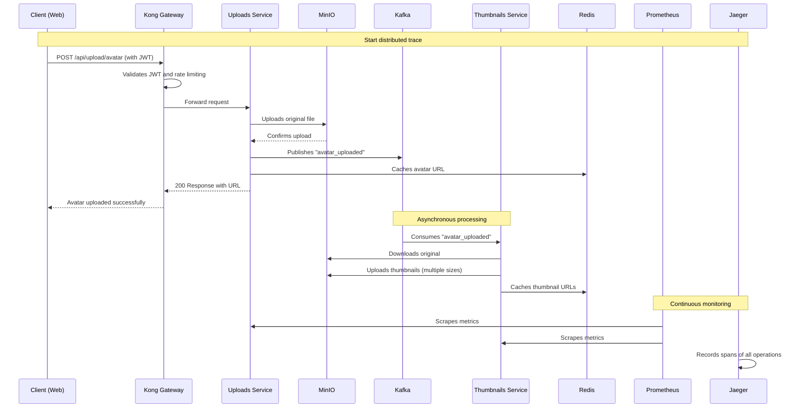
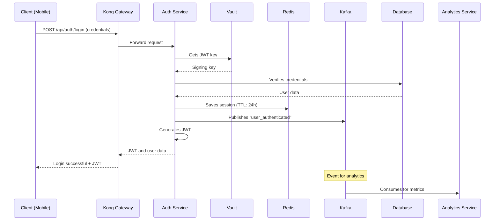
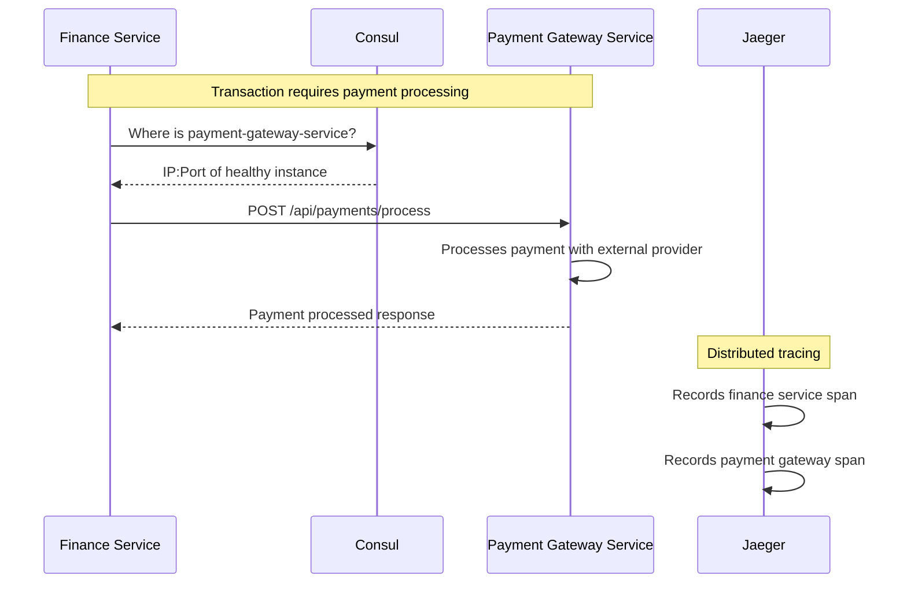
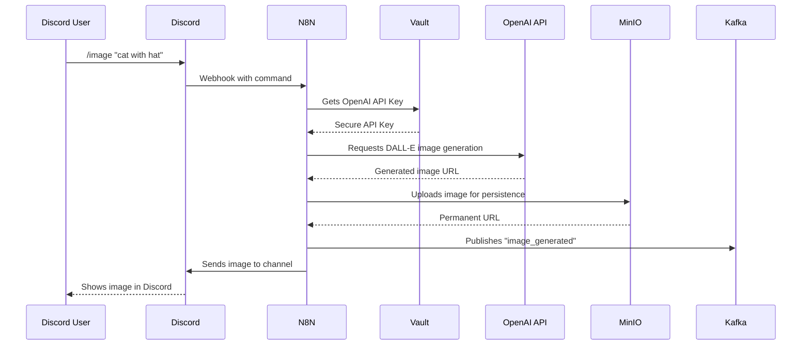
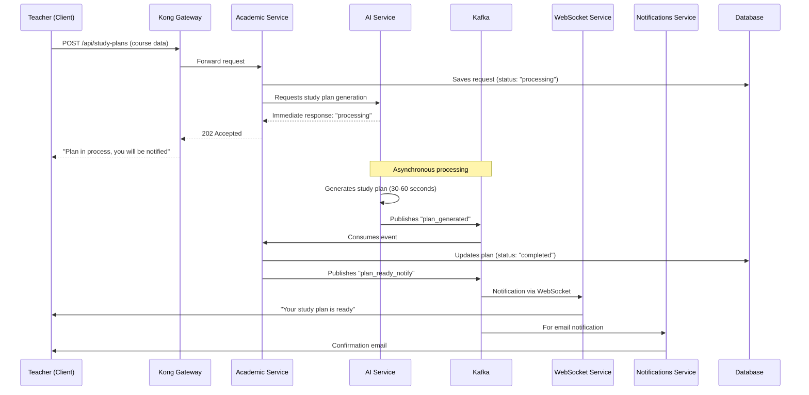
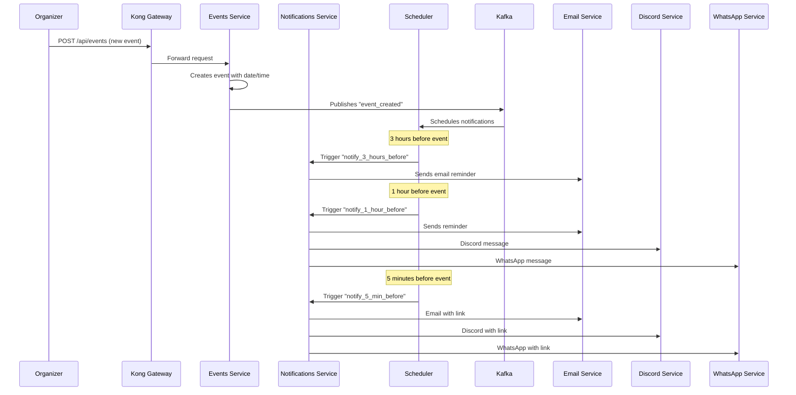
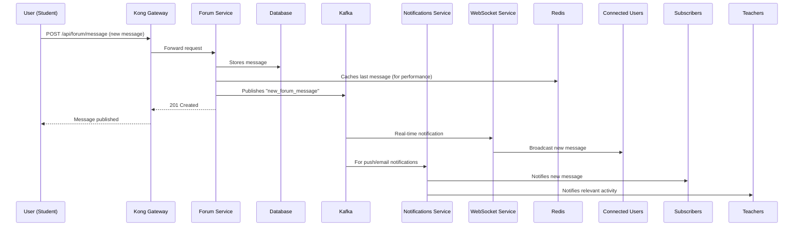
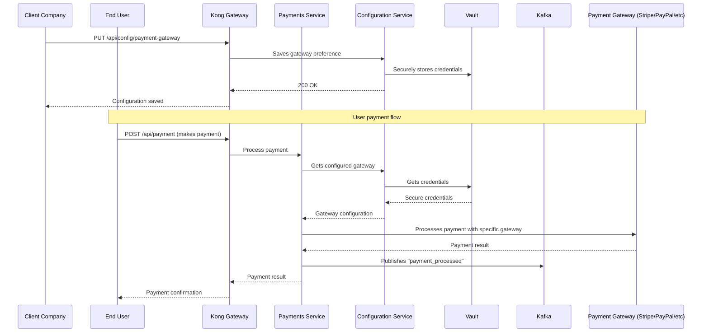

# Stack Explained for Beginners 🚀

Hello! 👋 If you're just starting out in software development and need to work with an infrastructure stack, this README is for you. Here I'll explain in simple terms with examples **what each service does**, **how they connect to each other**, and **what you can expect** when using them in a real project.

---

## 📚 Table of Contents
- [Stack Explained for Beginners 🚀](#stack-explained-for-beginners-)
  - [📚 Table of Contents](#-table-of-contents)
  - [1. What is this guide for? 📚](#1-what-is-this-guide-for-)
  - [2. Quick stack summary ✅](#2-quick-stack-summary-)
  - [3. Simple description of each service 🔍](#3-simple-description-of-each-service-)
    - [🤖 Kafka](#-kafka)
    - [🚀 Redis](#-redis)
    - [🔍 Consul](#-consul)
    - [📇 Jaeger](#-jaeger)
    - [📊 Prometheus](#-prometheus)
    - [📈 Grafana](#-grafana)
    - [🚪 Kong (API Gateway)](#-kong-api-gateway)
    - [☁️ MinIO](#️-minio)
    - [🔐 Vault](#-vault)
    - [⚙️ N8N](#️-n8n)
  - [4. How do they integrate? - Common flows 🔗](#4-how-do-they-integrate---common-flows-)
    - [🔄 Flow A: User file upload (e.g., avatar)](#-flow-a-user-file-upload-eg-avatar)
    - [🔐 Flow B: Login and session](#-flow-b-login-and-session)
    - [🔎 Flow C: Microservice discovering another (Consul)](#-flow-c-microservice-discovering-another-consul)
    - [🤖 Flow D: Automation with N8N for Messaging](#-flow-d-automation-with-n8n-for-messaging)
    - [🎓 Flow E: Study plan creation with AI and WebSocket notification](#-flow-e-study-plan-creation-with-ai-and-websocket-notification)
    - [📅 Flow F: Scheduled event notifications](#-flow-f-scheduled-event-notifications)
    - [💬 Flow G: Discussion forum between students and teachers](#-flow-g-discussion-forum-between-students-and-teachers)
    - [💳 Flow H: Client-specific payment gateways](#-flow-h-client-specific-payment-gateways)
  - [5. Security best practices and recommendations 🔒](#5-security-best-practices-and-recommendations-)
  - [6. Glossary of terms for beginners 🧠](#6-glossary-of-terms-for-beginners-)

---

## 1. What is this guide for? 📚

To help you understand, step by step in simple language, the services that commonly appear in modern projects: messaging, caching, observability, secrets management, object storage, and automation. All explained as if a patient colleague were telling you about them.

---

## 2. Quick stack summary ✅

*   **Kafka** — messaging / events
*   **Redis** — cache and fast in-memory data structures
*   **Consul** — service discovery and health checks
*   **Jaeger** — distributed tracing
*   **Prometheus** — metrics collection
*   **Grafana** — dashboards to view metrics
*   **Kong** — API Gateway (entry point to your APIs)
*   **MinIO** — file storage (S3 compatible)
*   **Vault** — secure secrets management
*   **N8N** — low-code automation / orchestration

---

## 3. Simple description of each service 🔍

> For each service you'll see: **What it is**, **What it's for**, **Simple example**, and **Why use it in microservices vs monolith?**

### 🤖 Kafka
*   **What it is:** A system to send and store events/messages quickly, durably, and in order.
*   **What it's for:** Communicating parts of your system without tight coupling (producer → topic → consumer). Ideal for processing data streams.
*   **Simple example:** When a user uploads a photo, the service receiving the photo publishes a "photo_uploaded" event in Kafka; another service (thumbnailer) reads that event and creates thumbnails.
*   **Microservices:** Ideal. Allows decoupling, parallel event processing, and replaying events if needed.
*   **Monolith:** Useful for pipelines (analytics), but might be overkill for small apps.

**💡 WebSockets Integration Example:**
You can use Kafka as a message queue for real-time chat. When a user sends a message, a WebSocket publishes it to a Kafka topic. Another service consumes those messages and broadcasts them to all connected clients via WebSocket. This allows you to scale connection and message processing components separately.

### 🚀 Redis
*   **What it is:** In-memory database, super fast.
*   **What it's for:** Caching, counters, sessions, lightweight pub/sub, game leaderboards.
*   **Simple example:** Cache the response of a database query for 60 seconds to avoid repeating the query.
*   **Microservices:** Very useful for shared caches, distributed locks, and rate limiting.
*   **Monolith:** Equally useful for caching and sessions.

**💡 Gamification Example:**
You can use Redis data structures (like **Sorted Sets**) to implement a leaderboard system in an application with gamification elements. Every time a user earns points, you update their score in the sorted set. Redis automatically maintains the order, making it very efficient to get the top 10 users.

### 🔍 Consul
*   **What it is:** Service registry and discovery + health checks.
*   **What it's for:** Allows services to find each other without fixed IPs in dynamic environments.
*   **Simple example:** The user service registers its IP/port; the orders service asks Consul "where is the user service?" and Consul responds.
*   **Microservices:** Very useful in dynamic environments where IPs change.
*   **Monolith:** Usually not needed if everything is deployed together.

### 📇 Jaeger
*   **What it is:** Tool for tracking the path of a request across services (distributed tracing).
*   **What it's for:** Detecting which service is slow or failing in a distributed operation.
*   **Simple example:** When processing an order, Jaeger shows you that the highest latency is in the call to the payment service.
*   **Microservices:** Almost essential for debugging latency.
*   **Monolith:** Useful for internal profiling but lower priority.

### 📊 Prometheus
*   **What it is:** System for collecting metrics (numbers) from your services.
*   **What it's for:** Measuring CPU usage, memory, requests per second, errors, etc.
*   **Simple example:** Monitor the number of requests per minute and alert if it spikes.
*   **Microservices:** Each service exposes metrics; Prometheus scrapes and centralizes them.
*   **Monolith:** Equally useful for monitoring behavior and alerts.

### 📈 Grafana
*   **What it is:** Tool for creating beautiful dashboards with your metrics.
*   **What it's for:** Visualizing trends, building panels for SRE or product teams.
*   **Simple example:** Dashboard with average latency, 5xx errors, and number of active users.
*   **Microservices and monolith:** Useful in both cases.

### 🚪 Kong (API Gateway)
*   **What it is:** Single entry point for your APIs. Handles authentication, rate-limiting, logging.
*   **What it's for:** Centralizing security policy and routing.
*   **Simple example:** All external calls first go to Kong; Kong validates the JWT and forwards to the appropriate service.
*   **Microservices:** Very useful for applying cross-cutting concerns without touching each microservice.
*   **Monolith:** Useful for exposing public versions and managing SSL, though sometimes a simple reverse proxy suffices.

**💡 Push Notifications Example:**
Kong can act as a single entry point for an API that manages push notifications. You can configure a rate-limiting plugin in Kong to prevent a single client from sending too many notifications. It can also handle authentication for SMS (Twilio) or Email (SendGrid, Mailgun) sending services.

### ☁️ MinIO
*   **What it is:** S3-compatible object storage (files).
*   **What it's for:** Storing photos, documents, backups, videos.
*   **Simple example:** The uploads service saves to MinIO; another service reads from MinIO to display images.
*   **Microservices:** Very useful for centralizing shared files.
*   **Monolith:** Useful for handling internal uploads without relying on the cloud.

### 🔐 Vault
*   **What it is:** Secure storage for secrets (keys, passwords, certificates).
*   **What it's for:** Avoiding putting passwords in code or repositories. Can generate credentials on demand and rotate them automatically.
*   **Simple example:** Your services request credentials from Vault at runtime and Vault delivers rotated credentials.
*   **Microservices:** Critical for security; managing access per service.
*   **Monolith:** Recommended to avoid hardcoding secrets.

**💡 AI Assistants Integration:**
You can use Vault to securely manage API Keys for services like OpenAI, DeepSeek, or Gemini. Your application or bot (e.g., a Discord bot) requests the key from Vault when it needs to make a request, instead of having it hardcoded in the code or in plain text environment variables. Vault can even rotate these keys if the API allows it.

### ⚙️ N8N
*   **What it is:** Tool for automating tasks (drag and drop nodes).
*   **What it's for:** Orchestrating integrations without writing microservices for everything.
*   **Simple example:** When a new user is created, N8N sends an email, adds the user to a CRM, and uploads a record to Google Sheets.
*   **Microservices:** Good as an orchestrator for integrations with external services.
*   **Monolith:** Useful for operational tasks you don't want to code in the main app.

**💡 Advanced Use Cases:**
*   **Messaging (WhatsApp/Telegram):** Set up a webhook in N8N that triggers when receiving a message from Twilio (for WhatsApp) or the Telegram API. Then, based on the message content, N8N can query a database, call an AI API to generate an intelligent response, and send the response back to the user.
*   **Discord Bots:** A Discord command can reach N8N via webhook. N8N can process it, for example, asking the OpenAI API to generate an image (DALL-E) or text, and then send the result back to the Discord channel.

---

## 4. How do they integrate? - Common flows 🔗

Below you'll see several *flows* with simple steps showing how the services can work together. Think of these as recipes.

### 🔄 Flow A: User file upload (e.g., avatar)

**Description:** A user uploads their profile picture through the web application.

1. The user selects and uploads an avatar image from the web interface
2. The system validates their identity, stores the original image and automatically generates thumbnails
3. The image URLs are cached for fast access
4. The user receives immediate confirmation while processing continues in the background

### 🔐 Flow B: Login and session

**Description:** A user logs into the educational platform.

1. The user enters their credentials in the mobile application
2. The system verifies credentials and generates a secure JWT token
3. The session is stored in Redis with expiration time
4. Other services are notified about the login for analytics
5. The user receives the token to access protected resources

### 🔎 Flow C: Microservice discovering another (Consul)

**Description:** The finance service needs to consult the payment gateway service to process a transaction.

1. The finance service queries Consul to find a healthy instance of the payment gateway service
2. Consul returns the location of an available instance
3. The finance service communicates directly with the payment gateway to process the transaction
4. The entire process is traced for distributed monitoring

### 🤖 Flow D: Automation with N8N for Messaging

**Description:** A user requests to generate an image via Discord command.

1. A user executes a Discord command to generate an image with AI
2. Discord sends the command to N8N via webhook
3. N8N securely retrieves the OpenAI API Key from Vault
4. The image is generated using DALL-E and stored permanently in MinIO
5. The generated image is sent back to the Discord channel and other services are notified

### 🎓 Flow E: Study plan creation with AI and WebSocket notification

**Description:** A teacher requests creation of a personalized study plan using AI, with real-time notification when ready.

1. A teacher requests creation of a personalized study plan for a course
2. The system accepts the request and sends it to asynchronous processing
3. The AI service takes 30-60 seconds to generate the educational plan
4. Once completed, the teacher is notified in real-time via WebSocket
5. A confirmation email is also sent for record keeping

### 📅 Flow F: Scheduled event notifications

**Description:** The system automatically notifies event participants 3 hours before, 1 hour before, and 5 minutes before the event.

1. An organizer creates a new event in the system
2. The system automatically schedules reminders at specific times
3. Staggered notifications are sent: 3 hours before by email, 1 hour before by multiple channels, and 5 minutes before with direct links
4. Participants receive timely reminders through their preferred channels

### 💬 Flow G: Discussion forum between students and teachers

**Description:** Forum system where students and teachers discuss topics and assignments with real-time notifications.

1. A student posts a message in the course forum
2. The message is stored in the database and cached for better performance
3. Other users receive real-time notifications via WebSocket
4. Teachers and subscribers receive push notifications or emails about the new activity
5. The discussion remains fluid with instant updates for all participants

### 💳 Flow H: Client-specific payment gateways

**Description:** Different client companies can configure their preferred payment gateways (Stripe, PayPal, MercadoPago).

1. A client company configures their preferred payment gateway in the system
2. The gateway credentials are securely stored in Vault
3. When an end user makes a payment, the system checks that company's specific configuration
4. Secure credentials are retrieved and the payment is processed with the configured gateway
5. The payment result is notified and recorded for tracking

---

## 5. Security best practices and recommendations 🔒

*   **Never** store secrets in code or repositories. Use Vault.
*   UI protection: Redis Commander, Konga, Kafka UI should not be public without authentication.
*   Always use TLS for external traffic (Kong can handle TLS termination).
*   Control cardinality in Prometheus (avoid too many dynamic labels).
*   Sampling in Jaeger: don't trace 100% if you don't have storage capacity.
*   Backups for MinIO and Kafka configurations (don't lose data).

---

## 6. Glossary of terms for beginners 🧠

*   **Broker:** Server that receives and delivers messages (Kafka is a broker).
*   **Topic:** Channel/topic where messages are published in a messaging system like Kafka.
*   **Cache:** Temporary storage for fast responses (Redis).
*   **Tracing / Trace / Span:** Tracking a request step by step (Jaeger). A "trace" is the complete path, and a "span" represents a single operation within that path.
*   **Metric / Scrape:** Measured number (requests/sec); Prometheus "scrapes" endpoints to collect them.
*   **API Gateway:** Entry point for APIs; manages auth, limits, and logging (Kong).
*   **Object Storage / Bucket:** Place to store files as objects, rather than in a file hierarchy (MinIO, S3).
*   **Secrets:** Credentials / keys that you must protect (Vault).
*   **Webhook:** A URL that accepts HTTP requests (usually POST) from an external service to notify about an event.
*   **Pub/Sub (Publish/Subscribe):** Messaging pattern where "emitters" (publishers) send messages to a "topic" without knowing which "receivers" (subscribers) will receive them.
*   **WebSocket:** Communication protocol that allows a bidirectional, persistent connection between client and server.
*   **Rate Limiting:** Limiting the number of requests a client can make in a time period.
*   **Health Check:** Periodic verification to determine if a service is functioning correctly.