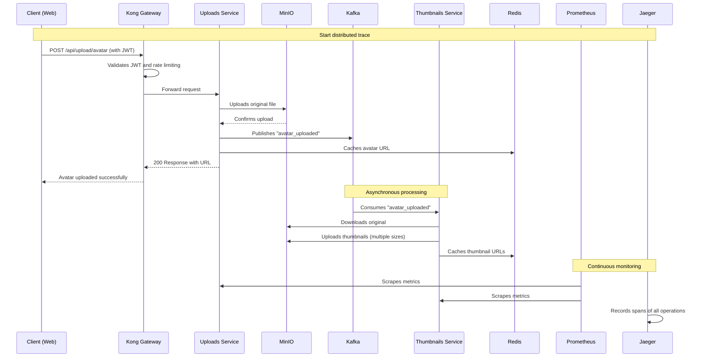
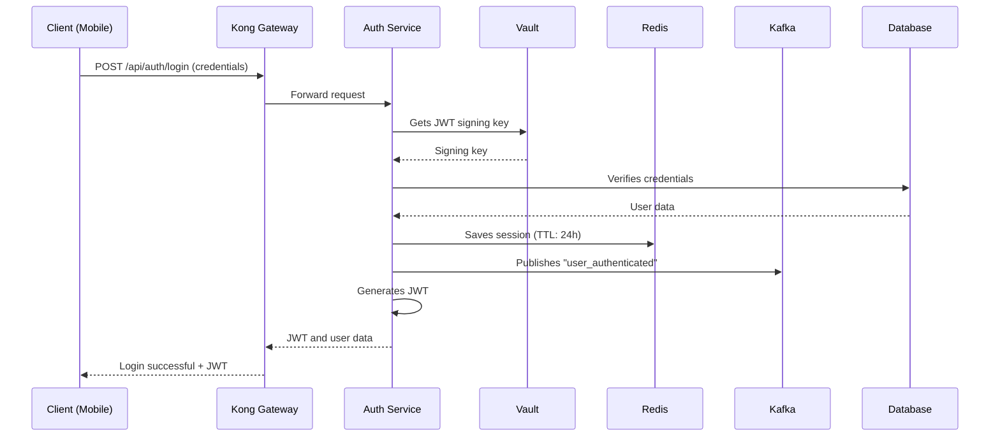
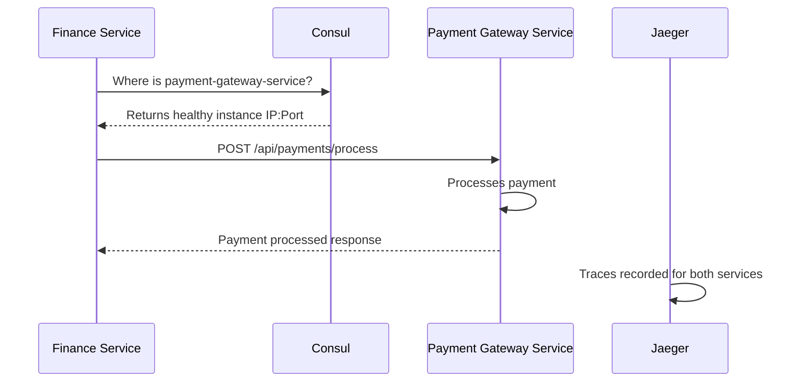
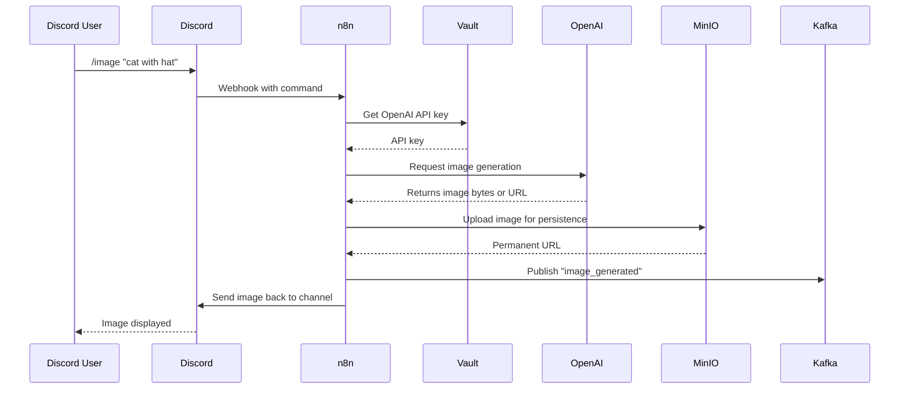

# Dev Container — Multi-Service Development Environment

> A complete `README.md` that explains each service, includes real world use-case sequence diagrams, and gives **connection examples** for **Node.js, PHP, Go, .NET, Rust and Java**.
> Intended for developers using this Docker Compose dev container for monoliths or microservices.

---

[](https://www.docker.com/) [](https://choosealicense.com/licenses/mit/) [](https://microservices.io/) [](https://github.com/hashicorp/hcl)

**Authors:** [@Santiago1010](https://github.com/Santiago1010)

---

# Table of contents

- [Dev Container — Multi-Service Development Environment](#dev-container--multi-service-development-environment)
- [Table of contents](#table-of-contents)
- [Overview](#overview)
- [Features](#features)
- [Environment variables](#environment-variables)
- [Run locally](#run-locally)
- [Services — explanation \& purpose](#services--explanation--purpose)
  - [Kafka](#kafka)
  - [Redis](#redis)
  - [Consul](#consul)
  - [Jaeger](#jaeger)
  - [Prometheus](#prometheus)
  - [Grafana](#grafana)
  - [Kong (API Gateway)](#kong-api-gateway)
  - [MinIO](#minio)
  - [Vault](#vault)
  - [n8n](#n8n)
- [Common flows — Use cases with sequence diagrams](#common-flows--use-cases-with-sequence-diagrams)
  - [Flow A — User file upload (avatar + async thumbnails)](#flow-a--user-file-upload-avatar--async-thumbnails)
  - [Flow B — Login \& session (Vault + Redis + Kafka)](#flow-b--login--session-vault--redis--kafka)
  - [Flow C — Service discovery with Consul](#flow-c--service-discovery-with-consul)
  - [Flow D — Automation via n8n (Discord + AI + MinIO)](#flow-d--automation-via-n8n-discord--ai--minio)
  - [Additional flows (summarized)](#additional-flows-summarized)
- [Connection examples — by service and language](#connection-examples--by-service-and-language)
  - [Redis](#redis-1)
  - [PostgreSQL](#postgresql)
  - [Kafka](#kafka-1)
  - [Consul](#consul-1)
  - [Vault](#vault-1)
  - [MinIO (S3 API)](#minio-s3-api)
  - [Kong (API Gateway)](#kong-api-gateway-1)
  - [Observability — Jaeger \& Prometheus](#observability--jaeger--prometheus)
- [API reference — service UIs \& ports](#api-reference--service-uis--ports)
- [Security best practices \& recommendations](#security-best-practices--recommendations)
- [FAQ](#faq)
- [Contributing](#contributing)
- [License \& Acknowledgements](#license--acknowledgements)
- [Glossary (for beginners)](#glossary-for-beginners)

---

# Overview

This repository contains a Docker Compose development environment with commonly used infra for modern applications:

* **Kafka (+ Zookeeper)** — event streaming
* **Redis** — in-memory cache & pub/sub
* **PostgreSQL (multiple instances)** — relational DBs
* **Consul** — service discovery & health checks
* **Vault** — secrets manager
* **n8n** — workflow automation low-code tool
* **Jaeger** — distributed tracing
* **Prometheus + Grafana** — monitoring & dashboards
* **MinIO** — S3 compatible object storage
* **Kong** — API gateway & policy enforcement

Use it to prototype integrations, test observability, exercise event flows, or run local integration tests.

---

# Features

* Preconfigured local services for development
* Example env file and test script to verify service health
* Examples of connecting to services from multiple languages
* Common architecture flows documented and visualized with sequence diagrams
* Basic monitoring, tracing, and secrets demonstration

---

# Environment variables

Copy `.env.example` → `.env` and adjust:

```bash
# Redis
REDIS_PASSWORD=redispass123

# PostgreSQL (n8n)
POSTGRES_USER=n8n
POSTGRES_PASSWORD=n8npassword
POSTGRES_DB=n8n

# PostgreSQL (Kong)
KONG_PG_USER=kong
KONG_PG_PASSWORD=kongpassword
KONG_PG_DATABASE=kong

# n8n
N8N_ENCRYPTION_KEY=n8n-encryption-key-change-this

# Grafana
GRAFANA_ADMIN_USER=admin
GRAFANA_ADMIN_PASSWORD=admin123

# MinIO
MINIO_ROOT_USER=minioadmin
MINIO_ROOT_PASSWORD=minioadmin123
```

---

# Run locally

```bash
git clone https://github.com/Santiago1010/dev-container
cd dev-container
docker-compose up -d
./scripts/test_services.sh   # verifies health of services
```

To fully reset data volumes:

```bash
docker-compose down -v
docker-compose up -d
```

---

# Services — explanation & purpose

Below each service is briefly explained with a short example of why and when to use it.

## Kafka

* **What:** Distributed streaming platform (publish/subscribe, durable logs).
* **Use:** Decouple producers/consumers, build event-driven systems, analytics pipelines, replayable event history.
* **Why:** Scale consumers independently, guarantee ordering per partition, retain event history.

## Redis

* **What:** In-memory key-value store.
* **Use:** Caching, sessions, rate limiting, locks, leaderboards, lightweight pub/sub.
* **Why:** Extremely low latency for hot data and ephemeral state.

## Consul

* **What:** Service registry + health checks + simple KV store.
* **Use:** Dynamic service discovery, health status, configuration distribution.
* **Why:** Useful when instances come and go (e.g., containers, autoscaling).

## Jaeger

* **What:** Distributed tracing system.
* **Use:** Trace requests across microservices, find latency hotspots and errors.
* **Why:** Observability in distributed systems.

## Prometheus

* **What:** Metrics collection via scraping endpoints.
* **Use:** Resource / application metrics, alerting rules.
* **Why:** Pull model fits ephemeral services and exposes metrics over HTTP.

## Grafana

* **What:** Visualization and dashboards for metrics/traces.
* **Use:** Build dashboards (latency, errors, throughput), alerting visualization.
* **Why:** Single pane of glass for SRE and product metrics.

## Kong (API Gateway)

* **What:** API gateway with plugin system.
* **Use:** Central authentication, rate limiting, routing, observability plugins.
* **Why:** Centralize cross-cutting concerns outside application code.

## MinIO

* **What:** S3-compatible object storage.
* **Use:** Store uploads, backups, media files locally in dev.
* **Why:** Works like S3 but local and easy to test.

## Vault

* **What:** Secrets management, dynamic secrets, encryption.
* **Use:** Keep API keys, DB creds, rotate credentials securely.
* **Why:** Avoid secrets in code and provide fine-grained access control.

## n8n

* **What:** Low-code automation/orchestration tool.
* **Use:** Wire external APIs, build webhooks, simple integrations without code.
* **Why:** Fast to build integrations and automation for non-core flows.

---

# Common flows — Use cases with sequence diagrams

The flows below use `mermaid` sequence diagrams. They describe the typical interaction between services.

---

## Flow A — User file upload (avatar + async thumbnails)



---

## Flow B — Login & session (Vault + Redis + Kafka)



---

## Flow C — Service discovery with Consul



---

## Flow D — Automation via n8n (Discord + AI + MinIO)



---

## Additional flows (summarized)

* Scheduled event reminders (scheduler → Kafka → notifications)
* Forum real-time messaging (post → DB → Kafka → WebSocket broadcasts → Redis cache)
* Client-specific payment gateways stored in Vault, returned at runtime for processing

---

# Connection examples — by service and language

> These examples are minimal connect/read/write snippets to get you started. Replace host/port/credentials with your `.env` values. Add production concerns (TLS, retries, timeouts, error handling) for real deployments.

---

## Redis

**Node.js (redis v4)**

```javascript
import { createClient } from 'redis';
const client = createClient({ url: 'redis://:redispass123@localhost:6379' });
await client.connect();
await client.set('key', 'value');
const v = await client.get('key');
console.log(v);
await client.disconnect();
```

**PHP (Predis)**

```php
require 'vendor/autoload.php';
$client = new Predis\Client([
  'scheme' => 'tcp', 'host' => '127.0.0.1', 'port' => 6379, 'password' => 'redispass123'
]);
$client->set('key', 'value');
echo $client->get('key');
```

**Go (go-redis v9)**

```go
ctx := context.Background()
rdb := redis.NewClient(&redis.Options{Addr: "localhost:6379", Password: "redispass123", DB: 0})
defer rdb.Close()
err := rdb.Set(ctx, "key", "value", 0).Err()
val, err := rdb.Get(ctx, "key").Result()
fmt.Println(val)
```

**.NET (StackExchange.Redis)**

```csharp
var conn = await ConnectionMultiplexer.ConnectAsync("localhost:6379,password=redispass123");
var db = conn.GetDatabase();
await db.StringSetAsync("key", "value");
var val = await db.StringGetAsync("key");
Console.WriteLine(val);
```

**Rust (redis crate + async-std/tokio)**

```rust
let client = redis::Client::open("redis://:redispass123@127.0.0.1/").unwrap();
let mut con = client.get_async_connection().await.unwrap();
let _: () = redis::cmd("SET").arg(&["key","value"]).query_async(&mut con).await.unwrap();
let val: String = redis::cmd("GET").arg(&["key"]).query_async(&mut con).await.unwrap();
```

**Java (Jedis)**

```java
Jedis jedis = new Jedis("localhost", 6379);
jedis.auth("redispass123");
jedis.set("key", "value");
String value = jedis.get("key");
System.out.println(value);
jedis.close();
```

---

## PostgreSQL

**Node.js (pg)**

```javascript
import { Client } from 'pg';
const client = new Client({ host:'localhost', port:5432, user:'n8n', password:'n8npassword', database:'n8n' });
await client.connect();
const res = await client.query('SELECT NOW()');
console.log(res.rows);
await client.end();
```

**PHP (PDO)**

```php
$dsn = "pgsql:host=127.0.0.1;port=5432;dbname=n8n";
$pdo = new PDO($dsn, "n8n", "n8npassword");
$stmt = $pdo->query("SELECT NOW()");
$row = $stmt->fetch(PDO::FETCH_ASSOC);
print_r($row);
```

**Go (database/sql + lib/pq)**

```go
connStr := "host=localhost port=5432 user=n8n password=n8npassword dbname=n8n sslmode=disable"
db, _ := sql.Open("postgres", connStr)
rows, _ := db.Query("SELECT NOW()")
```

**.NET (Npgsql)**

```csharp
var cs = "Host=localhost;Username=n8n;Password=n8npassword;Database=n8n;Port=5432";
await using var conn = new NpgsqlConnection(cs);
await conn.OpenAsync();
await using var cmd = new NpgsqlCommand("SELECT NOW()", conn);
await using var reader = await cmd.ExecuteReaderAsync();
```

**Rust (tokio-postgres)**

```rust
let (client, connection) = tokio_postgres::connect("host=localhost user=n8n password=n8npassword dbname=n8n", NoTls).await?;
tokio::spawn(async move { connection.await.unwrap(); });
let rows = client.query("SELECT NOW()", &[]).await?;
```

**Java (JDBC)**

```java
String url = "jdbc:postgresql://localhost:5432/n8n";
Properties props = new Properties();
props.setProperty("user","n8n");
props.setProperty("password","n8npassword");
Connection conn = DriverManager.getConnection(url, props);
Statement st = conn.createStatement();
ResultSet rs = st.executeQuery("SELECT NOW()");
```

---

## Kafka

**Node.js (kafkajs)**

```javascript
import { Kafka } from 'kafkajs';
const kafka = new Kafka({ clientId: 'app', brokers: ['localhost:9092'] });
const producer = kafka.producer();
await producer.connect();
await producer.send({ topic: 'test-topic', messages: [{ value: 'Hello Kafka!' }] });
await producer.disconnect();
```

**PHP (php-rdkafka)**

```php
$conf = new RdKafka\Conf();
$rk = new RdKafka\Producer($conf);
$rk->addBrokers("localhost:9092");
$topic = $rk->newTopic("test-topic");
$topic->produce(RD_KAFKA_PARTITION_UA, 0, "Hello Kafka!");
```

**Go (segmentio/kafka-go)**

```go
w := kafka.NewWriter(kafka.WriterConfig{Brokers: []string{"localhost:9092"}, Topic: "test-topic"})
w.WriteMessages(context.Background(), kafka.Message{Value: []byte("Hello Kafka!")})
w.Close()
```

**.NET (Confluent.Kafka)**

```csharp
var config = new ProducerConfig { BootstrapServers = "localhost:9092" };
using var p = new ProducerBuilder<Null, string>(config).Build();
await p.ProduceAsync("test-topic", new Message<Null, string> { Value = "Hello Kafka!" });
```

**Rust (rdkafka)**

```rust
let producer: FutureProducer = ClientConfig::new()
    .set("bootstrap.servers", "localhost:9092")
    .create()?;
producer.send(BaseRecord::to("test-topic").payload("Hello Kafka!"), 0).await?;
```

**Java (Apache Kafka client)**

```java
Properties props = new Properties();
props.put("bootstrap.servers", "localhost:9092");
Producer<String,String> producer = new KafkaProducer<>(props, new StringSerializer(), new StringSerializer());
producer.send(new ProducerRecord<>("test-topic", "Hello Kafka!"));
producer.close();
```

---

## Consul

**Node.js (consul npm)**

```javascript
const Consul = require('consul');
const consul = Consul({ host: '127.0.0.1', port: 8500 });
await consul.agent.service.register({ name: 'my-service', address: 'localhost', port: 3000 });
```

**PHP (consul-php client or HTTP)**

```php
// simple HTTP register
$ch = curl_init("http://127.0.0.1:8500/v1/agent/service/register");
curl_setopt($ch, CURLOPT_POSTFIELDS, json_encode(['Name'=>'my-service','Port'=>3000]));
curl_exec($ch);
```

**Go (hashicorp/consul/api)**

```go
client, _ := api.NewClient(api.DefaultConfig())
registration := &api.AgentServiceRegistration{Name: "my-service", Address: "localhost", Port: 3000}
client.Agent().ServiceRegister(registration)
```

**.NET (Consul nuget)**

```csharp
var client = new ConsulClient(cfg => cfg.Address = new Uri("http://localhost:8500"));
await client.Agent.ServiceRegister(new AgentServiceRegistration { Name = "my-service", Port = 3000 });
```

**Rust (use HTTP or consulrs)**

```rust
// simplest: POST /v1/agent/service/register with serde JSON using reqwest
```

**Java (Orbitz consul-client or HTTP)**

```java
// Use HTTP: POST to http://localhost:8500/v1/agent/service/register
```

---

## Vault

**Node.js (node-vault)**

```javascript
const Vault = require('node-vault')({ endpoint: 'http://127.0.0.1:8200', apiVersion: 'v1' });
await Vault.write('secret/data/my-secret', { data: { password: 'my-password' } });
const secret = await Vault.read('secret/data/my-secret');
console.log(secret);
```

**PHP (HTTP / hashicorp-vault-php)**

```php
// POST to /v1/secret/data/my-secret with token header - use any HTTP client
```

**Go (github.com/hashicorp/vault/api)**

```go
client, _ := api.NewClient(&api.Config{Address: "http://127.0.0.1:8200"})
client.SetToken("root")
_, _ = client.Logical().Write("secret/data/my-secret", map[string]interface{}{"data": map[string]interface{}{"password":"my-password"}})
```

**.NET (VaultSharp)**

```csharp
var client = new VaultClient(new VaultClientSettings("http://localhost:8200", new TokenAuthMethodInfo("root")));
await client.V1.Secrets.KeyValue.V2.WriteSecretAsync("my-secret", new { password = "my-password" });
```

**Rust (reqwest to Vault HTTP API or vault-rs)**

```rust
// Use reqwest to call Vault HTTP API with token header
```

**Java (vault-java-driver)**

```java
Vault vault = new Vault(new VaultConfig().address("http://127.0.0.1:8200").token("root").build());
vault.logical().write("secret/data/my-secret", new HashMap<String,Object>(){{ put("data", Collections.singletonMap("password","my-password")); }});
```

---

## MinIO (S3 API)

**Node.js (AWS SDK v3 or minio SDK)**

```javascript
import { S3Client, PutObjectCommand } from "@aws-sdk/client-s3";
const s3 = new S3Client({ endpoint: "http://localhost:9000", region: "us-east-1", credentials: { accessKeyId: "minioadmin", secretAccessKey: "minioadmin123" }, forcePathStyle: true });
await s3.send(new PutObjectCommand({ Bucket: "uploads", Key: "avatar.png", Body: buffer }));
```

**PHP (aws/aws-sdk-php)**

```php
$s3 = new Aws\S3\S3Client([... 'endpoint' => 'http://localhost:9000', 'credentials' => [...], 'use_path_style_endpoint' => true]);
$s3->putObject(['Bucket'=>'uploads','Key'=>'avatar.png','Body'=>$content]);
```

**Go (minio-go)**

```go
minioClient, _ := minio.New("localhost:9000", &minio.Options{Creds: credentials.NewStaticV4("minioadmin", "minioadmin123", ""), Secure: false})
minioClient.PutObject(ctx, "uploads", "avatar.png", reader, size, minio.PutObjectOptions{})
```

**.NET (AWSSDK.S3)**

```csharp
var s3 = new AmazonS3Client("minioadmin","minioadmin123", new AmazonS3Config { ServiceURL = "http://localhost:9000", ForcePathStyle = true });
await s3.PutObjectAsync(new PutObjectRequest { BucketName = "uploads", Key = "avatar.png", InputStream = stream });
```

**Rust (aws-sdk-s3 or rusoto)**

```rust
// configure endpoint to http://localhost:9000 and use credentials; then put_object
```

**Java (AWS SDK)**

```java
S3Client s3 = S3Client.builder().endpointOverride(URI.create("http://localhost:9000")).credentialsProvider(StaticCredentialsProvider.create(AwsBasicCredentials.create("minioadmin","minioadmin123"))).region(Region.US_EAST_1).build();
s3.putObject(PutObjectRequest.builder().bucket("uploads").key("avatar.png").build(), RequestBody.fromBytes(bytes));
```

---

## Kong (API Gateway)

**Admin API (curl / HTTP) example**

* Register service & route with Kong Admin API: `POST /services` and `POST /routes`.
* Configure plugins (rate-limit, jwt) with Admin endpoints.

**Node.js (call upstream via Kong)**

```javascript
// Clients call Kong's public port (e.g., 8000) — Kong proxies to your upstream services.
fetch('http://localhost:8000/my-api/endpoint', { headers: { Authorization: 'Bearer <token>' }});
```

**Other languages:** use ordinary HTTP clients to call Kong’s proxy ports; use Kong Admin API to manage services.

---

## Observability — Jaeger & Prometheus

* **Jaeger:** instrument code with OpenTelemetry (OTel) SDK for each language and export spans to Jaeger collector (default at `http://localhost:14268` or UI at 16686).
* **Prometheus:** expose a `/metrics` endpoint; Prometheus scrapes it (default 9090). Use client libraries for each language to expose counters, histograms and gauges.

**Quick notes per language:**

* Node.js: `@opentelemetry/*`, `prom-client`
* Go: `go.opentelemetry.io/otel`, `prometheus/client_golang`
* Java: `opentelemetry-java`, `micrometer` or prometheus client_java
* .NET: `OpenTelemetry`, `prometheus-net` or `OpenTelemetry.Exporter.Prometheus`
* Rust: `opentelemetry` + `opentelemetry-jaeger`, `prometheus` crate

---

# API reference — service UIs & ports

| Service       | URL                                              | Port  | Description                       |
| ------------- | ------------------------------------------------ | ----- | --------------------------------- |
| Consul UI     | [http://localhost:8500](http://localhost:8500)   | 8500  | Service discovery & health checks |
| n8n           | [http://localhost:5678](http://localhost:5678)   | 5678  | Workflow automation UI            |
| Jaeger UI     | [http://localhost:16686](http://localhost:16686) | 16686 | Distributed tracing UI            |
| Vault         | [http://localhost:8200](http://localhost:8200)   | 8200  | Secrets management                |
| Prometheus    | [http://localhost:9090](http://localhost:9090)   | 9090  | Metrics collection UI             |
| Grafana       | [http://localhost:3000](http://localhost:3000)   | 3000  | Dashboards                        |
| MinIO Console | [http://localhost:9001](http://localhost:9001)   | 9001  | Object storage UI                 |
| Kong Admin    | [http://localhost:8001](http://localhost:8001)   | 8001  | Kong Admin API                    |
| Kong Manager  | [http://localhost:8002](http://localhost:8002)   | 8002  | Kong Manager UI (if enabled)      |
| Kong Proxy    | [http://localhost:8000](http://localhost:8000)   | 8000  | Public API proxy (ingress)        |

---

# Security best practices & recommendations

* **Never store secrets in code or VCS.** Use Vault and environment variables.
* **Protect admin UIs** (Redis Commander, Kafka UI, Consul UI, MinIO Console) behind auth or local network only.
* **Use TLS** for all external traffic (Kong can terminate TLS). In dev you can use self-signed certs; in prod get trusted certs.
* **Rotate credentials** and apply least privilege. Use Vault dynamic secrets where possible.
* **Control Prometheus cardinality** — avoid high-cardinality dynamic labels.
* **Sampling in Jaeger** — don’t trace 100% in heavy traffic; adjust sampling rate.
* **Backups:** backup MinIO buckets, PostgreSQL data and Kafka configs.
* **Network policies / firewall** to limit access between services in prod environments.

---

# FAQ

**Q: How do I check whether services are running?**
A: Run `./scripts/test_services.sh` — this checks health endpoints and ports.

**Q: How do I access the databases?**

* PostgreSQL (n8n): `localhost:5432`
* PostgreSQL (Kong): `localhost:5433`
* Redis: `localhost:6379`

**Q: How do I reset the environment?**
A:

```bash
docker-compose down -v
docker-compose up -d
```

**Q: Where do I put production credentials?**
A: Use Vault for secrets. Store only minimal runtime config in environment variables and keep them out of version control.

---

# Contributing

Contributions welcome! Please:

1. Fork the repo
2. Create a branch with your feature/fix
3. Open a pull request with a clear description and tests (if applicable)

See `CONTRIBUTING.md` for more details (suggested tests: service health, sample integration flows, docs improvements).

---

# License & Acknowledgements

**License:** MIT — see [LICENSE](https://choosealicense.com/licenses/mit/)
**Thanks / Acknowledgements:** HashiCorp (Consul, Vault), Apache Kafka, Docker Community, MinIO, Kong, Jaeger, Prometheus, Grafana, n8n.

---

# Glossary (for beginners)

* **Broker:** Server that receives and delivers messages (Kafka is a broker).
* **Topic:** Channel where messages are published (Kafka).
* **Cache:** Fast temporary store for repeatable reads (Redis).
* **Trace / Span:** Trace = whole request journey; Span = single operation within that journey (Jaeger).
* **Metric / Scrape:** Prometheus scrapes metrics endpoints to collect numbers (requests/sec, latency).
* **API Gateway:** Entry point that applies auth, rate limits and routing (Kong).
* **Object Storage / Bucket:** Storage for binary objects (MinIO/S3).
* **Secrets:** API keys, passwords and certificates that must be protected (Vault).
* **Webhook:** A URL that accepts HTTP POST requests from external services on events.
* **Pub/Sub:** Publish/Subscribe messaging pattern.
* **WebSocket:** Persistent bidirectional connection between client and server.
